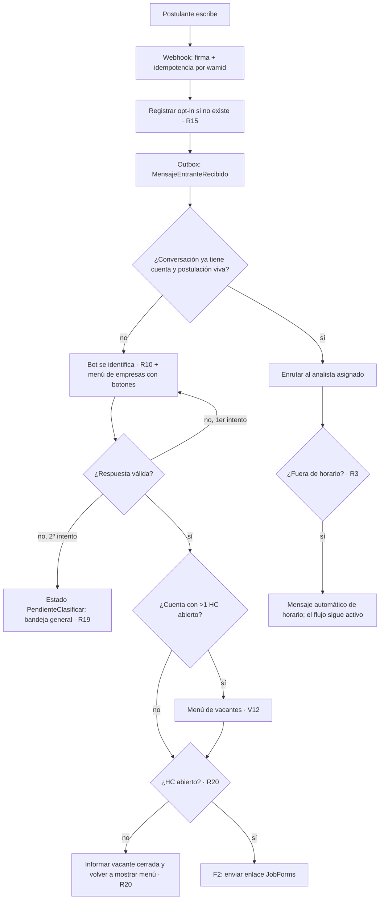
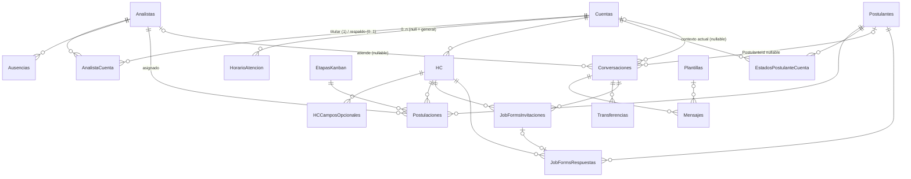
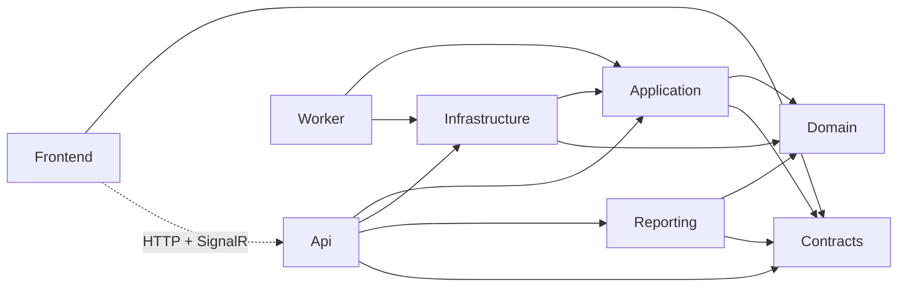
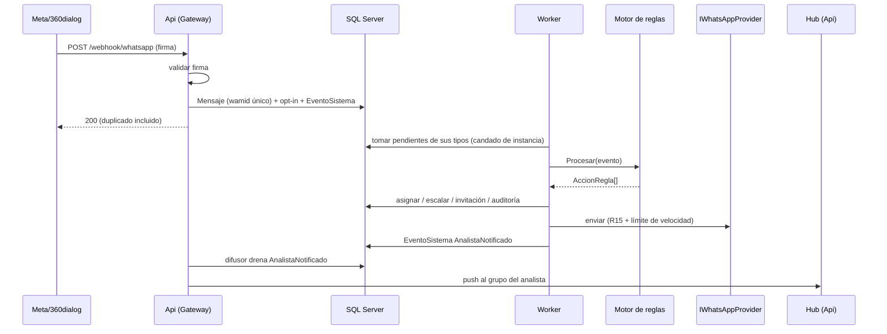

# Auditoría — Fase 1: Arquitectura funcional de referencia

> **Qué es este documento.** La línea base contra la que se audita el código en la Fase 2. Describe
> lo que el sistema **debe ser**, no lo que hoy es. No se revisó código para escribirlo.
>
> **Fuentes y precedencia** (de mayor a menor):
>
> 1. `docs/Dossier_Maestro_WhatsApp_RRHH_v2.docx`: requisitos y las 20 reglas. Etiqueta **[D §n]**.
> 2. `docs/decisiones.md`: decisiones (D1–D6) y desviaciones aprobadas (V1–V27). Cuando contradicen
>    al dossier, **prevalecen**, porque corrigen puntos donde el diseño no sostenía las reglas.
>    Etiqueta **[Vn]** / **[Dn]**.
> 3. `README.md`: estado *declarado* y detalles operativos. Se toma como **afirmación a verificar**,
>    no como hecho.
>
> Lo que no sale de ninguna fuente y el auditor deriva de las reglas lleva **[I]** (inferido). Esos
> puntos necesitan confirmación.

---

## 1. Propósito, actores y flujos

### 1.1 Propósito

Reemplazar el uso de WhatsApp Business desde varias PCs (que provocó el bloqueo de la línea por
multisesión, envíos sin opt-in y volumen) por la **WhatsApp Business API oficial**, con:

- un **bot** que identifica la empresa o vacante y envía el formulario de postulación (JobForms);
- **enrutamiento automático** a los analistas de cada cuenta, lo que elimina a los 2
  centralizadores (R5);
- una **bandeja multiagente** con chat, kanban por vacante, buscador por DNI y acciones rápidas;
- **cumplimiento anti-bloqueo por construcción** (R15, límite de velocidad, idempotencia);
- **métricas para gerencia** (R18).

Escala: 13 analistas, ~20 cuentas y ~16.000 interacciones al mes (≈ 730 por día hábil). El volumen
es bajo: el reto está en la **corrección** y el **cumplimiento de Meta**, no en el rendimiento.

### 1.2 Actores y roles

| Actor | Tipo | Autenticación | Descripción |
|---|---|---|---|
| **Postulante** | Externo | Ninguna (lo identifica su teléfono y luego su DNI) | Escribe por WhatsApp y completa el JobForms |
| **Analista** | Rol `Analista` | JWT propio [V20] | Atiende conversaciones y postulaciones de sus cuentas |
| **Jefatura** | Rol `Jefatura` [V23] | JWT | Métricas, titular y respaldo por cuenta, ausencias de cualquiera |
| **Sistemas** | Rol `Sistemas` | JWT | Estructura (cuentas, analistas, horario, parámetros). Ve todo pero no actúa sobre conversaciones [V22] |
| **Bot** | Sistema | — | Menús, enlaces, recordatorios y mensajes automáticos. Se identifica como bot (R10) |
| **Meta / 360dialog** | Sistema externo | Firma HMAC del webhook, API key saliente | Entrega mensajes entrantes y acuses. Recibe los salientes |
| **Google Forms + Apps Script** | Sistema externo | Secreto compartido `X-JobForms-Secreto` | Notifica el envío del formulario [D3, V27] |
| **Worker** | Proceso interno | Base de datos | Ejecuta la outbox y las reglas por tiempo |

#### Relación analista ↔ cuenta

- Cada cuenta tiene **exactamente un titular** y **como máximo un respaldo**, garantizado por índices
  únicos filtrados [V17, R1, R2].
- Un analista puede ser titular o respaldo de varias cuentas (R1).

#### Matriz de permisos (objetivo)

| Operación | Analista | Jefatura | Sistemas |
|---|---|---|---|
| Ver y actuar sobre una conversación que atiende | ✔ | — | solo ver |
| Ver y actuar sobre conversaciones «pendientes por clasificar» (R19) | ✔ | — | solo ver |
| Conversación ajena | **404** | **404** | solo ver |
| Tablero y tarjetas de una cuenta | titular o respaldo | — | solo ver |
| Buscador por DNI e historial | solo sus cuentas; del resto, aviso genérico (R6) [V22] | — | todo |
| Marcar whitelist o blacklist, transferir, mover etapa | sobre lo suyo | — | — |
| Responder transferencia recibida | destinatario | — | — |
| Crear, cerrar y configurar vacantes (HC) | titular o respaldo de la cuenta | — | ✔ |
| Registrar ausencia propia | ✔ | ✔ | ✔ |
| Registrar ausencia ajena, asignar titular o respaldo | — | ✔ | ✔ |
| Panel de métricas (R18) | — | ✔ | ✔ |
| Alta de cuentas y analistas, horario, parámetros, restablecer contraseñas | — | — | ✔ |
| Anonimizar postulante (`DELETE /postulantes/{dni}`) | — | — | ✔ |
| Catálogos (etapas, plantillas, vacantes abiertas, horario) | lectura | lectura | lectura |

> Quien no puede ver un recurso recibe **404**, para no confirmar que existe. Quien puede verlo
> pero no actuar recibe **403** con el motivo [V22].

### 1.3 Identificadores

| Identificador | Qué identifica | Notas |
|---|---|---|
| `TelefonoE164` | **El hilo** (`Conversacion`) | Clave natural única. Meta indexa por número: hay un solo hilo por teléfono [V1, V2] |
| `DNI` | **La persona** (`Postulante`) | Identificador principal del postulante (R9). Llega recién con el JobForms, por eso `Conversacion.PostulanteId` es nullable [V2] |
| (`PostulanteId`, `HCId`) | **El proceso** (`Postulacion`) | Lo que recorre el kanban [V1, D4] |
| `ProviderMessageId` (wamid) | Mensaje en Meta | Único (índice filtrado). Base de la idempotencia del webhook [D §9.6.2] |
| `Token` de invitación | Enlace del JobForms | Aleatorio, no secuencial. Nunca se expone `HCId` [D §9.6.1] |
| `CorrelationId` | Traza de extremo a extremo | En `Mensajes` y `EventosSistema` [D §9.6.2] |
| Claim del JWT | Analista que actúa | **El analista sale del token, nunca del cuerpo ni de la query** [V20] |
| `jti` | Token individual | Emitido; hoy no se revoca [V20] |

### 1.4 Flujos principales

#### F1 — Captación y clasificación (R10, R19, R20, R1, R3, R15)

#### F2 — Circuito JobForms (R9, R17, R20, R6, R14, R1)

1. La regla devuelve `EnviarLinkJobForms(HcId)`. El **ejecutor** crea `JobFormsInvitacion` con su
   token, arma la URL (reemplaza `{token}` o agrega `?t=`) y envía el mensaje [V12, V27].
2. El postulante completa el formulario: acepta el aviso de privacidad (R17) e ingresa DNI, datos,
   campos opcionales del HC y CV.
3. Apps Script → `POST /jobforms/webhook-google` con el secreto. La Api valida:
   - token vigente;
   - HC abierto (R20);
   - consentimiento (R17);
   - idempotencia: si ya se recibió, responde `yaRecibido` [V27].
4. Orden de persistencia: datos → `Postulante` (crear o actualizar por DNI) [V11] → `JobFormsRespuesta`
   → `Postulacion` (etapa inicial) → vincular `Conversacion.PostulanteId` → marcar la invitación
   completada.
5. Asignación de la postulación: titular de la cuenta, o respaldo si el titular está ausente (R14, R1).
6. Si el DNI tiene postulaciones vivas en otras cuentas: aviso genérico a cada analista (R6, R11).
7. Confirmación al postulante por el chat. Desde aquí conversa con el analista.
8. **Seguimiento por tiempo:** si no completa, recordatorio a las 24 h y aviso al analista a las 48 h
   (R9, Worker).

#### F3 — Atención y respuesta del analista (R4, R15, R2)

- La bandeja lista las conversaciones del analista agrupadas por cuenta (R4, §7).
- **Respuesta síncrona** dentro del request [V14]:
  1. el motor evalúa la R15 (opt-in y ventana de 24 h desde el último **entrante**);
  2. si la ventana cerró, rechaza con `RequierePlantilla` y la bandeja obliga a elegir una plantilla
     activa;
  3. si envía, marca `FechaUltimaRespuestaAnalista`, lo que detiene el reloj de la R2.
- Nunca se envía una plantilla con `Activa = false` [V8].

#### F4 — Escalamiento y ausencias (R2, R14, R3)

- **Barrido del Worker:** si la conversación asignada tiene un entrante sin respuesta humana durante
  `N` horas (parámetro, 2 por defecto), pasa al **respaldo fijo** de la cuenta y queda con estado
  `Escalada`. Solo cuenta el horario laboral si `escalamiento.solo_horario_laboral` está activo [V5].
- **Ausencia vigente del titular:** lo **nuevo** va directo al respaldo, sin esperar las 2 h (R14).
  Al terminar el período, el titular recupera sus cuentas automáticamente.

#### F5 — Gestión del proceso (R7, R8, R12, R13, R6)

- **Whitelist:** motivo opcional. **Blacklist:** motivo obligatorio, por cuenta (R7).
  - La blacklist descarta las postulaciones `EnProceso` de esa persona **en esa cuenta** y las mueve a
    la columna final [V13].
  - Descartar (por blacklist o arrastrando al kanban) dispara el **cierre de cortesía** (R12).
- **Kanban:** `POST /postulaciones/{id}/etapa` [V22]. Etapas sembradas: Postulante nuevo → En
  revisión → Entrevista → Contratado / Descartado (R13).
- **Transferencia (R8):**
  - una sola pendiente por conversación y siempre a un único analista;
  - normal (requiere aceptación) o urgente (efectiva al instante);
  - el destinatario acepta o rechaza desde la tarjeta sin abrir el chat, y el origen recibe el aviso
    en vivo [V21];
  - aceptar pasa **el hilo**, no la cuenta [V22].

#### F6 — Tiempo, cierre y datos (R9, R16, R17)

- **Repregunta (R9):** si un postulante conocido escribe tras 3 días de inactividad, se le vuelve a
  preguntar la empresa. No se hace si el analista ya decidió (contratado o descartado) [V10].
- **Archivado (R16):** 90 días sin actividad y sin postulación en proceso o contratada archivan el caso
  (`Postulacion.Estado = Archivada`, `Conversacion.Estado = Archivada`).
- **Retención (R17):** el Worker purga los CVs vencidos (`datos.retencion_cv_dias`).
  `DELETE /postulantes/{dni}` anonimiza en todas las cuentas.

#### F7 — Administración y puesta en marcha [V18, V23, V25]

1. `POST /sesion/arranque` crea el primer usuario de Sistemas. Solo acepta el correo configurado y se
   cierra en cuanto existe la primera contraseña.
2. Sistemas da de alta cuentas, analistas y horario. Jefatura o Sistemas asignan titular y respaldo.
3. El titular o respaldo crea las vacantes con su `UrlJobForms` y sus campos opcionales.

#### F8 — Tiempo real (§9.6.3) [V16]

Regla → outbox (`AnalistaNotificado`) → bucle difusor en la Api → hub SignalR `/hub/bandeja`, con un
grupo por analista tomado del claim → la bandeja recarga. El sondeo periódico queda como respaldo.

#### F9 — Métricas (R18) [V15]

`GET /reportes/metricas?desde=&hasta=` devuelve, además del desglose por cuenta:

| Métrica | Criterio |
|---|---|
| Primera respuesta | Solo respuestas humanas, no el bot. Promedio **y** mediana |
| Conversión | Postulación → contratado |
| Actividad por analista | Acciones registradas por analista |

Corre en un contexto de solo lectura (`ReportingDbContext`) sobre las tablas transaccionales.

---

## 2. Requerimientos

### 2.1 Mapa de las 20 reglas por disparador y responsable

| R | Regla | Disparador | Dónde vive la decisión | Quién ejecuta |
|---|---|---|---|---|
| 1 | Asignación | Evento (cuenta identificada / postulación creada) | `IReglaNegocio` | `IConversacionService.AsignarAnalista`, `IPostulacionService` |
| 2 | Escalamiento 2 h | Tiempo | Regla (Worker, barrido) | `IConversacionService.Escalar` |
| 3 | Fuera de horario | Mensaje entrante | Regla + `IHorarioAtencionService` | Envío por outbox |
| 4 | Visibilidad | Toda petición HTTP y el hub | Filtro / `NivelAcceso` [V22] | Api |
| 5 | Sin centralizadores | — (consecuencia de R1 + R19) | — | — |
| 6 / 11 | Multi-cuenta, aviso genérico | Evento (postulación en 2ª cuenta) | Regla | Notificación (outbox → hub) |
| 7 | Whitelist / blacklist | Acción del usuario | Servicio + cascada [V13] | `MarcarEstado` |
| 8 | Transferencia | Acción del usuario | Servicio | `Transferir`, `ResponderTransferencia` |
| 9 | JobForms: link, 24 h, 48 h, repregunta 3 d | Evento + tiempo + entrante | 2 clases, mismo código R09 [V10] | Ejecutor (invitación) [V12] |
| 10 | Transparencia del bot | Primer mensaje saliente | Contenido del menú | — |
| 12 | Cierre de cortesía | Evento (descarte) | Regla | Plantilla por outbox |
| 13 | Kanban | Acción del usuario | Servicio | `MoverEtapaKanban` |
| 14 | Ausencias | Evento (asignación) + tiempo (fin) | Regla + `IAusenciaService` | Asignación al respaldo |
| 15 | Opt-in y ventana de 24 h | **Todo saliente** | Guardia transversal | Bloquea o exige plantilla |
| 16 | Archivado 90 d | Tiempo | Regla (Worker) | Servicios de dominio |
| 17 | Consentimiento y retención | Formulario + tiempo + usuario | `IJobFormsService.ValidarConsentimiento`, purga | Worker, `AnonimizarDatos` |
| 18 | Métricas | Consulta | `IReportingReadModel` | Reporting |
| 19 | Fallback de menú | Entrante con texto libre | Regla | Estado `PendienteClasificar` |
| 20 | HC cerrada | Selección de HC / envío de formulario / cierre | Regla + `ValidarVacanteActiva` | Menú de nuevo |

### 2.2 Requerimientos funcionales

| ID | Requerimiento | Reglas / fuente |
|---|---|---|
| RF-01 | Recibir el webhook del proveedor, validar la firma, descartar duplicados por `ProviderMessageId` y encolar en la outbox sin lógica de negocio | §8.1, §9.6.2 |
| RF-02 | Verificar el webhook (GET de verificación de Meta) | Operativo |
| RF-03 | Registrar opt-in (`FechaOptIn`, `OrigenOptIn`) al primer entrante o al completar el JobForms | R15 [V4] |
| RF-04 | Procesar acuses de entrega y actualizar `EstadoEntrega` | §9.2 |
| RF-05 | Bot: identificarse, mostrar menú de cuentas con botones, reintentar una vez y derivar a «pendientes por clasificar» | R10, R19 |
| RF-06 | Mostrar solo cuentas activas con titular y al menos un HC abierto; si hay más de un HC, menú de vacantes | R1, R20 [V12] |
| RF-07 | Crear la invitación con token y enviar el enlace del JobForms del HC | R9 [V12, V27] |
| RF-08 | Recibir el formulario: validar token, HC abierto, consentimiento e idempotencia | R9, R17, R20 [V27] |
| RF-09 | Registrar o actualizar el postulante por DNI, guardar respuesta y CV, y crear la postulación | R9 [V11] |
| RF-10 | Almacenar el CV fuera de SQL Server: tipo y tamaño limitados, cuarentena y antivirus | §9.6.1 |
| RF-11 | Confirmar al postulante por el chat tras el formulario | R9 |
| RF-12 | Asignar al titular, o al respaldo si hay ausencia vigente | R1, R14 |
| RF-13 | Avisar a los analistas de otras cuentas donde el DNI está en proceso, sin detalle | R6, R11 |
| RF-14 | Recordatorio a las 24 h y aviso al analista a las 48 h si no completa el formulario | R9 |
| RF-15 | Repreguntar la empresa tras 3 días de inactividad, salvo marca del analista | R9 |
| RF-16 | Mensaje automático fuera de horario, sin cortar el flujo | R3 |
| RF-17 | Escalar al respaldo tras N horas sin respuesta humana, respetando horario | R2 [V5] |
| RF-18 | Bandeja por analista agrupada por cuenta, más transferencias pendientes arriba | R4, §7 [V21] |
| RF-19 | Buscador por DNI e historial del postulante acotados por visibilidad | §7, §6.1 [V22] |
| RF-20 | Chat: ver hilo y responder con texto libre o plantilla según la R15, síncrono | R15 [V14] |
| RF-21 | Whitelist y blacklist por cuenta (motivo obligatorio en blacklist), con cascada a postulaciones | R7 [V13] |
| RF-22 | Cierre de cortesía al descartar | R12 |
| RF-23 | Transferir (una pendiente, a un analista, urgente o con aceptación) y responder | R8 [V21] |
| RF-24 | Kanban por vacante con columnas arrastrables | R13 [V22] |
| RF-25 | Archivar a los 90 días sin actividad y sin proceso vivo o contratado | R16 |
| RF-26 | Purgar CVs según retención; anonimizar a pedido | R17, §9.6.1 |
| RF-27 | Panel de métricas: primera respuesta (promedio y mediana), conversión, actividad, por cuenta | R18 |
| RF-28 | Administrar cuentas, analistas, titular y respaldo, ausencias, HC y campos opcionales, horario, parámetros | §9.4 [V18, V23] |
| RF-29 | Catálogo de plantillas visible, sin activación desde la aplicación | [V8] |
| RF-30 | Login, cambio y restablecimiento de contraseña, arranque del primer usuario de Sistemas | §9.6.1 [V20, V25] |
| RF-31 | Notificaciones en vivo: escalamiento, transferencia, aviso de 48 h, multi-cuenta | §9.6.3 [V16] |
| RF-32 | Auditoría de movimientos de kanban, marcas y transferencias | §9.2 |
| RF-33 | Reintentar salientes transitorios (5xx, 429, red) con retroceso; nunca los ambiguos; revalidar la R15 | README |
| RF-34 | Health: `/health/vivo` (proceso) y `/health` (base + latidos + instancia activa) | §9.6.2 [V19] |

### 2.3 Requerimientos no funcionales críticos

| ID | Categoría | Requerimiento | Por qué es crítico |
|---|---|---|---|
| RNF-01 | **Anti-bloqueo** | Ningún saliente sin opt-in; fuera de 24 h, solo plantilla aprobada y activa | Causa del bloqueo original (§2.4) |
| RNF-02 | **Anti-bloqueo** | Límite de velocidad saliente en el adaptador (`envio.maximo_por_segundo`), no evitable | §9.6.4 |
| RNF-03 | **Anti-duplicado** | Idempotencia en el webhook de Meta, en el webhook de Google y en los reintentos. Un único Worker activo (candado `sp_getapplock`) | Duplicar mensajes = señal de spam [V24, V27] |
| RNF-04 | Confiabilidad | Outbox con `IntentosProcesamiento`, `UltimoError` y estado `Fallido`; eventos sin consumidor quedan pendientes | §9.6.2 [V9] |
| RNF-05 | Concurrencia | `RowVersion` en `Conversaciones` y `Transferencias` | Worker escalando vs. analista respondiendo |
| RNF-06 | Seguridad | Autorización por defecto: todo requiere token; lo público se marca uno a uno | [V20] |
| RNF-07 | Seguridad | Autorización por objeto en la frontera HTTP (`NivelAcceso`), 404 frente a 403 | R4 [V22] |
| RNF-08 | Seguridad | PBKDF2-SHA256 con 210.000 iteraciones y sal por usuario; login de tiempo constante; `Jwt__Clave` ≥ 32 caracteres obligatoria | [V20] |
| RNF-09 | Seguridad | Rate limiting en endpoints públicos (30/min por IP), tokens no enumerables, antivirus de CVs | §9.6.1 |
| RNF-10 | Seguridad | Secretos solo por variables de entorno de máquina | §9.6.1 [V26] |
| RNF-11 | Privacidad | Ley 29733 (Perú): consentimiento con versión, retención definida, eliminación real | R17 |
| RNF-12 | Mantenibilidad | Reglas como Strategy: deciden (`AccionRegla`) y no ejecutan; una prueba unitaria por regla, sin base de datos | §8.2, §9.6.6 |
| RNF-13 | Mantenibilidad | Límites de proyecto (sección 4.2) sin violaciones | §8.1 |
| RNF-14 | Parametrización | Ningún literal de tiempo o tope en código; todo en `ConfiguracionReglas` | §8.3 |
| RNF-15 | Tiempo | UTC en base de datos; presentación y horario laboral en `America/Lima` (UTC-5) | Convención |
| RNF-16 | Operación | Migraciones EF versionadas (no editar las aplicadas); `AUTO_CLOSE` desactivado | §9.6.5 |
| RNF-17 | Operación | Respaldos coordinados base + CVs (primero la base) con verificación | §9.6.5 |
| RNF-18 | Observabilidad | Latido por bucle con tolerancia propia, `CorrelationId` de extremo a extremo, monitor externo de `/health` | §9.6.2 [V19] |
| RNF-19 | Disponibilidad | Pool de IIS sin apagado por inactividad ni reciclado; Worker como servicio con recuperación ante fallas | [V26] |
| RNF-20 | Portabilidad | Proveedor intercambiable (`IWhatsAppProvider`): Meta Cloud, 360dialog, simulado | §8.2 [D2] |
| RNF-21 | Rendimiento | Adecuado para ~16.000 interacciones al mes; Reporting separable a réplica | [V15] |

---

## 3. Diseño de la base de datos (modelo objetivo)

### 3.1 Diagrama de entidades

Tablas sin relación de negocio: `EventosSistema`, `ConfiguracionReglas`, `Auditoria` (polimórfica
por `EntidadTipo` y `EntidadId`), `LatidosServicio` y las credenciales de analista.

### 3.2 Tablas por módulo

#### Organización

| Tabla | Campos clave | Restricciones | Origen |
|---|---|---|---|
| `Cuentas` | `CuentaId`, `Nombre`, `Activo` | `Nombre` único | [D §9.2], sin `CodigoJobForms` [V3] |
| `Analistas` | `AnalistaId`, `Nombre`, `Email`, `Rol` (Analista / Jefatura / Sistemas), `Activo`, hash + sal de contraseña | `Email` único y normalizado | [D], [V20, V23] |
| `AnalistaCuenta` | `AnalistaId`, `CuentaId`, `EsBackup` | PK compuesta; **único por cuenta filtrado `EsBackup=0`** y **`EsBackup=1`** | [D], [V17] |
| `Ausencias` | `AusenciaId`, `AnalistaId`, `FechaInicio`, `FechaFin`, `Motivo` | `FechaFin ≥ FechaInicio` [I] | R14 |
| `HorarioAtencion` | `HorarioId`, `CuentaId?`, `DiaSemana`, `HoraInicio`, `HoraFin` | Horas en hora de Lima [I] | R3 |

#### Vacantes

| Tabla | Campos clave | Restricciones | Origen |
|---|---|---|---|
| `HC` | `HCId`, `CuentaId`, `Titulo`, `Estado` (Abierta / Cerrada), `FechaCreacion`, `UrlJobForms` | `UrlJobForms` admite `{token}` | [D], [V3, V27] |
| `HCCamposOpcionales` | `CampoId`, `HCId`, `NombreCampo`, `Tipo`, `Activo` | Se desactiva, no se borra | [D] |

#### Postulante y proceso

| Tabla | Campos clave | Restricciones | Origen |
|---|---|---|---|
| `Postulantes` | `PostulanteId`, `DNI`, `Nombre`, `Telefono`, `Email`, `FechaRegistro` | `DNI` único; anonimizable | [D], §9.6.1 |
| `Postulaciones` | `PostulacionId`, `PostulanteId`, `HCId`, `AnalistaAsignadoId`, `EtapaKanbanId`, `Estado` (EnProceso / Contratado / Descartado / Archivada), fechas | Único (`PostulanteId`, `HCId`) [I] | [D4, V1] |
| `EtapasKanban` | `EtapaId`, `Nombre`, `Orden` | Sembrada | [D] |
| `EstadosPostulanteCuenta` | `EstadoId`, `PostulanteId`, `CuentaId`, `Tipo` (Whitelist / Blacklist), `Motivo`, `AnalistaId`, `Fecha` | `Motivo` obligatorio si es Blacklist | R7 |

#### Canal WhatsApp

**`Conversaciones`** [D, V1, V2, V4, §9.6.2]

- `ConversacionId`
- `TelefonoE164` (**único**)
- `PostulanteId?`, `CuentaId?`, `AnalistaAsignadoId?`
- `Estado` (Activa / Escalada / PendienteClasificar / Cerrada / Archivada)
- `FechaUltimoMensaje`, `FechaUltimoMensajeEntrante` [I, R15], `FechaUltimaRespuestaAnalista`
- `FechaOptIn`, `OrigenOptIn`
- `FechaCreacion`, `RowVersion`
- Estado del bot: paso del menú y reintentos de la R19 [I]
- **Sin** `EtapaKanbanId`, que pasa a `Postulaciones`

**`Mensajes`** [D, §9.6.2, README]

- `MensajeId`, `ConversacionId`, `Direccion`, `Contenido`
- `PlantillaId?`, `ParametrosPlantilla`
- `FechaEnvio`, `EstadoEntrega`
- `ProviderMessageId` (**único filtrado**), `CorrelationId`
- Autor: bot o analista (`AnalistaId?`) [I, R18]
- Datos de reintento

**`Transferencias`** [D, V21]

- `TransferenciaId`, `ConversacionId`, `AnalistaOrigenId`, `AnalistaDestinoId`
- `Urgente`, `Estado` (Pendiente / Aceptada / Rechazada), `Comentario`
- `Fecha`, `FechaRespuesta`, `RowVersion`
- Restricción: una sola `Pendiente` por conversación

**`Plantillas`** [D, V8]

- `PlantillaId`, `Nombre`, `NombreMeta`, `Categoria`, `TextoAprobado`, `Activa`
- Las 6 sembradas llevan `Activa = false`

#### JobForms

| Tabla | Campos clave | Restricciones | Origen |
|---|---|---|---|
| `JobFormsInvitaciones` | `InvitacionId`, `Token`, `ConversacionId`, `PostulanteId?`, `HCId`, `FechaEnvioLink`, `RecordatorioEnviado`/`FechaRecordatorio`, `AvisoAnalistaEnviado`/`FechaAvisoAnalista`, `Completado`/`FechaCompletado` | `Token` único; `PostulanteId` nullable porque el DNI se conoce después [I, coherente con V2] | [D], §9.6.1 |
| `JobFormsRespuestas` | `RespuestaId`, `InvitacionId` [I], `PostulanteId`, `HCId`, `DatosJson`, `CvUrl`/ruta, `ConsentimientoAceptado`, `VersionAvisoPrivacidad`, `FechaConsentimiento`, `FechaEnvio` | Una por invitación [V27] | [D] |

#### Plataforma

| Tabla | Campos clave | Restricciones | Origen |
|---|---|---|---|
| `EventosSistema` | `EventoId`, `Tipo`, `Payload`, `FechaCreacion`, `Estado` (Pendiente / Procesado / Fallido), `IntentosProcesamiento`, `UltimoError`, `CorrelationId` | Índice por (`Estado`, `Tipo`, `FechaCreacion`) [I, V9] | [D], §9.6.2 |
| `ConfiguracionReglas` | `Clave`, `Valor`, `Descripcion` | PK `Clave` | [D] |
| `Auditoria` | `AuditoriaId`, `EntidadTipo`, `EntidadId`, `AnalistaId`, `Accion`, `Fecha`, `Detalle` | — | [D] |
| `LatidosServicio` | bucle, `FechaUtc`, `ToleranciaSegundos`, instancia, detalle del ciclo | Uno por bucle | [V19] |

### 3.3 Invariantes que la base o los servicios deben garantizar

1. Un hilo por teléfono; una postulación por (persona, vacante).
2. Exactamente un titular por cuenta con operación; como máximo un respaldo.
3. Como máximo una transferencia pendiente por conversación.
4. Un `ProviderMessageId` no se registra dos veces.
5. Ningún `Mensaje` saliente sin `Conversacion.FechaOptIn`.
6. Ningún `Mensaje` saliente fuera de ventana sin `PlantillaId` de una plantilla activa.
7. El desenlace del proceso vive solo en `Postulacion.Estado` [V13].
8. Una invitación completada tiene exactamente una respuesta [V27].
9. Todo archivo de CV tiene una fila que lo referencia, y viceversa (base de la purga R17).

### 3.4 Parámetros esperados en `ConfiguracionReglas`

Confirmados en la documentación:

- `escalamiento.solo_horario_laboral`
- `envio.maximo_por_segundo`
- `envio.reintentos_maximos`
- `datos.retencion_cv_dias`

Requeridos por las reglas, con clave exacta por verificar en la Fase 2:

- horas de escalamiento (2)
- horas del recordatorio (24) y del aviso al analista (48)
- días para repreguntar (3)
- días de archivado (90)
- reintentos del menú (1)
- versión vigente del aviso de privacidad

---

## 4. Arquitectura de software

### 4.1 Estilo

**Monolito modular** [D §8] desplegado como **tres procesos** [V26]:

| Proceso | Hospedaje | Expuesto a |
|---|---|---|
| Api | Sitio IIS | Internet (webhook, JobForms) + red interna |
| Frontend (bandeja) | Sitio IIS | Solo red interna |
| Worker | Servicio de Windows | — |

### 4.2 Proyectos y dependencias permitidas

Cualquier otra referencia es una **violación** que se reportará en la Fase 2.

### 4.3 Responsabilidad por capa

| Capa | Proyecto | Contiene | No debe contener |
|---|---|---|---|
| **Entidades y contratos de dominio** | Domain | Entidades, enums, interfaces de servicio (§9.3), `IReglaNegocio`, `AccionRegla`, `ContextoRegla`, las reglas | EF Core, HTTP, proveedor |
| **Casos de uso** | Application | `IMotorReglas`, ejecutor de acciones, casos (`RecepcionJobForms`, `EnvioAnalista`…), procesador de outbox | SQL, detalles del proveedor |
| **DTOs** | Contracts | Peticiones y respuestas de bandeja, seguridad y métricas | Lógica, referencias |
| **Persistencia y adaptadores** | Infrastructure | `DbContext` + migraciones, implementación de servicios de dominio, `IWhatsAppProvider` (Meta, 360dialog, simulado), almacenamiento de CV y antivirus | Decisiones de negocio |
| **Repositorios** | — | **No hay capa Repository**: `DbContext` es la unidad de trabajo, y la frontera por módulo son los servicios de dominio | Repositorios genéricos |
| **Controladores** | Api | Webhook, REST §9.4, autenticación, políticas, filtro `NivelAcceso`, hub, difusor, health | Lógica de reglas, acceso directo a tablas de otro módulo |
| **Tiempo** | Worker | Bucles: outbox, barrido por tiempo (R2, R9, R14, R16), purga (R17), reintento saliente; guardia de candado; latidos | Endpoints |
| **Lectura** | Reporting | `ReportingDbContext` de solo lectura, `IReportingReadModel` | Escrituras |
| **Presentación** | Frontend | Páginas Blazor, `ClienteApi`, sesión, cliente del hub | Referencias a Domain o Infrastructure; SQL |

> La decisión sobre la capa Repository se toma en [V6].

### 4.4 Motor de reglas

- **Contrato:** `IReglaNegocio.Evaluar(ContextoRegla) → AccionRegla`. Las reglas son puras: leen el
  contexto y los parámetros con `ContextoRegla.ConfigInt/ConfigBool`.
- **`FabricaContextoRegla`** (Infrastructure) arma el contexto con los datos necesarios.
- **Motor:** filtra las reglas por `TipoDisparador` (mensaje entrante, tiempo, formulario, acción),
  las evalúa en **orden de prioridad** y entrega las acciones al **ejecutor**.
- **Ejecutor** (Application): traduce cada `AccionRegla` a llamadas a servicios, envíos y eventos de
  outbox (`AnalistaNotificado`, etc.).
- **R15 es una guardia**: todo camino de envío (outbox, respuesta síncrona, reintento) la consulta.

### 4.5 Secuencia de un mensaje entrante

### 4.6 Interfaces de dominio esperadas (§9.3 + desviaciones)

| Interfaz | Métodos | Nota |
|---|---|---|
| `IWhatsAppProvider` | `EnviarMensaje`, `RecibirWebhook` (+ plantillas, botones, verificación de firma) | Adapter |
| `IReglaNegocio`, `IMotorReglas` | `Evaluar`, `Procesar` | Strategy |
| `IConversacionService` | `ObtenerOCrear`, `AsignarAnalista`, `Escalar`, `Transferir`, `MarcarEstado`, (+ responder transferencia) | `MoverEtapaKanban` pasa a postulaciones [V1] |
| `IPostulacionService` | crear, mover etapa, descartar o contratar, archivar | Nueva [D4] |
| `IPostulanteService` | `BuscarPorDni`, `RegistrarDesdeFormulario(DatosPostulanteFormulario)`, `ObtenerHistorial`, `AnonimizarDatos` | [V11], §9.6.1 |
| `IJobFormsService` | `ValidarEnvio`, `AlmacenarCv`, `ValidarVacanteActiva`, `ValidarConsentimiento` | |
| `IJobFormsInvitacionService` | `CrearInvitacion`, `MarcarRecordatorioEnviado`, `MarcarAvisoAnalistaEnviado`, `MarcarCompletado` | |
| `IPlantillaService` | `ObtenerPlantillaParaEvento`, `ValidarVentana24h` | |
| `IAusenciaService` | `RegistrarAusencia`, `EstaAusente` | |
| `IHorarioAtencionService` | `EstaEnHorario` | |
| `IReportingReadModel` | `ObtenerMetricas` | |
| `IAutenticacionService` | login, cambio y restablecimiento, arranque | [V20] |
| `IAlmacenamientoCv` (+ escáner) | guardar con cuarentena, borrar | §9.6.1 |

### 4.7 Endpoints esperados

**Públicos** (`[AllowAnonymous]`, con rate limit donde aplica):

- `GET/POST /webhook/whatsapp`
- `GET /jobforms/{token}`
- `POST /jobforms/webhook-google`
- `POST /jobforms/{token}/enviar`
- `POST /sesion/login`
- `POST /sesion/arranque`
- `GET /health`, `GET /health/vivo`

**Bandeja:**

- `GET /conversaciones` (analista del token)
- `GET /conversaciones/{id}`
- `GET /conversaciones/buscar?dni=`
- `POST /conversaciones/{id}/responder`
- `POST /conversaciones/{id}/marcar`
- `POST /conversaciones/{id}/transferir`
- `GET /transferencias/pendientes`
- `POST /transferencias/{id}/responder`
- `POST /postulaciones/{id}/etapa`
- `GET /postulantes/{dni}/historial`
- `DELETE /postulantes/{dni}`

**Administración:**

- `GET/POST /cuentas`, `POST /cuentas/{id}/analistas`
- `GET/POST /analistas`, `GET /analistas/{id}/cuentas`, `POST /analistas/{id}/ausencias`
- `POST /hc`, `PATCH /hc/{id}/cerrar`, `GET/PUT /hc/{id}/campos`
- `GET /plantillas`
- `GET/PUT /configuracion/horario`, `GET/PUT /configuracion/reglas`

**Sesión:**

- `GET /sesion/yo`
- `PUT /sesion/contrasena`
- `PUT /sesion/analistas/{id}/contrasena`

**Reportes:** `GET /reportes/metricas`

**Tiempo real:** `/hub/bandeja`

### 4.8 Pantallas esperadas (§7)

| Pantalla | Contenido |
|---|---|
| `/bandeja` | Lista por cuenta + transferencias + DNI + chat + acciones + ventana de 24 h + aviso multi-cuenta |
| `/tablero/{hcId}` | Kanban |
| `/vacantes` | Crear y cerrar vacantes, campos opcionales |
| `/metricas` | Panel de gerencia |
| `/equipo` | Cuentas, analistas, titular y respaldo, ausencias |
| `/configuracion` | Horario, parámetros, estado de plantillas |
| `/mi-cuenta` | Contraseña y ausencias propias |
| Login | Acceso |

---

## 5. Puntos abiertos — RESUELTOS (validación 2026-09-14)

**Criterio de validación indicado por el usuario:** se adopta la opción recomendada en cada caso,
**priorizando la atención preferente al postulante**. Las resoluciones forman parte de la línea
base desde ahora: prevalecen sobre la redacción original de las tablas 5.1 y 5.2, que se conservan
debajo solo como registro.

**Tarea pendiente:** trasladar cada resolución a `docs/decisiones.md` (agente `arquitecto`). Está
en el backlog de la Fase 4.

### 5.0 Principios derivados

- **P1 — El bot habla en texto libre dentro de la ventana de 24 h.** Las plantillas se usan solo
  cuando la ventana está cerrada. Es lo que permite Meta y evita que el postulante se quede sin
  respuesta mientras las plantillas esperan aprobación.
- **P2 — Continuidad del interlocutor.** Un postulante con proceso vivo no pierde a su analista por
  inactividad, ausencias ni repreguntas.
- **P3 — Ningún mensaje del postulante queda sin dueño ni sin plazo.** Todo hilo tiene un analista
  responsable o está en «Sin clasificar» con un plazo que dispara un aviso.
- **P4 — Cero mensajes repetidos al postulante.** Menús, avisos y cierres salen una sola vez por
  hecho que los motiva.

### 5.1 Resoluciones

**A1 — Transferencia urgente**

- Urgente es la que marca el analista cuando el postulante espera respuesta o tiene una cita
  próxima. Se aplica al instante.
- La no urgente vence a las `transferencia.horas_vencimiento` horas hábiles (por defecto, las mismas
  del escalamiento). Al vencer vuelve al origen con aviso, y el origen puede retirarla antes.
- Mientras está pendiente, el origen sigue siendo responsable y el reloj de la R2 sigue corriendo.

**A2 — Reingreso**

- Nuevo estado de postulación `Reingreso`: la persona vuelve a un proceso (ex-trabajador o descarte
  reconsiderado). Lo marca el analista.
- Cuenta como proceso vivo: no se archiva (R16), no se repregunta la empresa (R9) y sus mensajes van
  directo a su analista, sin menú.

**A3 — Hilo único con dos cuentas**

- Si el postulante tiene procesos vivos en más de una cuenta, cada saliente del analista lleva el
  prefijo `[Cuenta · Vacante]`.
- Ante un entrante ambiguo, el bot pregunta con botones «¿Sobre qué proceso nos escribes?» con sus
  procesos vivos y la opción «Otra empresa».

**A4 — Historial por DNI:** acotado a las cuentas del analista, con el aviso genérico para las
demás. Se mantiene V22.

**A5 — Retención**

- Parámetro `datos.retencion_cv_dias` (365). Se cuenta desde la **última actividad del postulante**,
  no desde el envío, para no borrar el CV de alguien en proceso.
- Versión del aviso parametrizada. La confirmación con Legal queda en el checklist y no bloquea el
  desarrollo.

**A6 — Menú con ~20 cuentas**

1. **Principal:** enlace del aviso `wa.me/<número>?text=Postulo <CÓDIGO>` con un código único por
   HC. El bot lo reconoce y salta el menú.
2. **Alternativa:** lista paginada de 9 cuentas más una fila «Ver más empresas».
3. Antes de contar un texto libre como intento fallido, se compara contra los nombres de cuenta y
   los códigos.

**A7 — R3 vs R4:** responden el titular o el respaldo de la cuenta. «Sin clasificar» sigue siendo
visible y tomable por todos.

**A8 — Frecuencia del aviso fuera de horario**

- Una vez por período fuera de horario por conversación, registrado en `Conversacion.FechaAvisoFueraHorario`.
- El texto dice cuándo se retoma la atención y sale en texto libre (P1).

**A9 — Segundo nivel de la R2**

- Si el respaldo tampoco responde en N horas hábiles: aviso a Jefatura y marca «vencida» en la
  bandeja del titular y del respaldo.
- No hay otra reasignación automática.

**A10 — Fin de ausencia**

- Lo que recibió el respaldo durante la ausencia se queda con él hasta cerrarse o transferirse (P2).
- Lo nuevo vuelve al titular. Al volver, el titular recibe un aviso con esa lista.

**A11 — Cierre de cortesía (R12)**

- Automático por defecto (`cierre.automatico = true`). Al descartar, el analista puede marcar «no
  enviar».
- Sale en horario laboral y una sola vez por postulación.

**A12 — Silencio ante el menú**

- No se envía nada por silencio.
- Si el postulante escribió texto libre no reconocido y pasan `menu.horas_derivacion` horas hábiles
  (2) sin opción válida, el hilo pasa a «Sin clasificar» para que una persona lea lo que escribió.

**A13 — Días de inactividad de la R9:** desde el último mensaje en cualquier dirección.

**A14 — Alcance del archivado**

- Se archivan las postulaciones sin actividad en 90 días, salvo `Contratado` y `Reingreso`.
  Opcionalmente, aviso previo al analista a los `conversacion.aviso_archivado_dias`.
- La conversación se archiva cuando no le queda ningún proceso vivo.
- Si el postulante vuelve a escribir, se reactiva con su historial intacto.

**A15 — Métricas**

- Se acepta V15 (lectura de tablas transaccionales).
- La primera respuesta se mide **por cada tanda de mensajes entrantes** y en **horas hábiles**,
  coherente con la R2, e incluye el % dentro del plazo.

### 5.2 Registro original de dudas (histórico)

#### Heredadas y no resueltas en la documentación

| # | Tema | Duda | Fuente |
|---|---|---|---|
| A1 | Transferencia urgente | ¿Qué la hace urgente? ¿Vence una transferencia no contestada? | R8, §12, V21 |
| A2 | Marca «reingreso» | No existe en `EstadoPostulacion`. ¿Qué significa en la operación? | R9, R16, riesgos |
| A3 | Hilo único con dos cuentas | ¿Cómo ve el postulante que dos analistas de cuentas distintas le escriben por el mismo número? (propuesta: prefijo con cuenta o vacante) | V1 |
| A4 | Historial por DNI | ¿Completo o acotado a las cuentas del analista? Choca con la R6 | V22 |
| A5 | Plazo de retención de CVs y versión del aviso de privacidad | Pendiente con Legal | R17 |

#### Detectadas por el auditor [I]

| # | Tema | Duda |
|---|---|---|
| A6 | **Límite de botones de WhatsApp** | Los mensajes interactivos admiten 3 botones de respuesta, y las listas hasta 10 filas en total. Con ~20 cuentas, el menú de empresas (R9, R19) **no cabe en un solo mensaje**. ¿Paginación («Ver más»), agrupación, o una lista distinta según el aviso de origen? |
| A7 | R3 vs. R4 | «Cualquier analista puede responder igual»: ¿cualquiera **de la cuenta**, o literalmente cualquiera? Lo segundo rompe la R4. Se asume lo primero |
| A8 | R3, frecuencia | ¿El mensaje de fuera de horario sale en **cada** entrante o una vez por período? Repetirlo por mensaje es spam hacia el postulante |
| A9 | R2, segundo nivel | Si el respaldo tampoco responde, ¿termina ahí o hay otro escalamiento? Se asume que termina ahí |
| A10 | R14, fin de ausencia | «Recupera automáticamente sus cuentas»: ¿vuelven también las conversaciones que recibió el respaldo durante la ausencia, o solo lo nuevo? |
| A11 | R12, «puede disparar» | ¿Cierre automático siempre, configurable por parámetro, o a elección del analista al descartar? |
| A12 | R19, silencio | Si el postulante no contesta el menú (ni válido ni inválido), ¿queda sin clasificar para siempre o hay temporizador? |
| A13 | R9, «3 días de inactividad» | ¿Contados desde el último mensaje en cualquier dirección o desde el último entrante? |
| A14 | R16, alcance del archivado | ¿Archiva la postulación, la conversación, o ambas? |
| A15 | Métricas | ¿Se aceptan V15 (sin proyección por eventos) y el criterio «solo respuestas humanas»? |

---

## 6. Cómo se usará este documento en la Fase 2

Cada hallazgo se clasificará como:

| Clase | Significado |
|---|---|
| ✅ Conforme | Cumple lo descrito aquí |
| ⚠️ Parcial / riesgo | Existe, pero incompleto o frágil |
| ❌ Ausente | No existe |
| 🔀 Desviación no documentada | Distinto de lo descrito y sin decisión que lo respalde |

Todo hallazgo irá referenciado a la sección (RF, RNF, invariante 3.3, capa 4.3) y al archivo.

Ejes de la auditoría:

1. Límites entre proyectos (`.csproj`).
2. Modelo EF y migraciones contra la sección 3.
3. Las 20 reglas y sus pruebas contra la sección 2.1.
4. Guardia R15 en **todos** los caminos de envío.
5. Autorización por endpoint y por objeto.
6. Outbox, idempotencia y concurrencia.
7. Worker: bucles, candado, latidos.
8. Frontend: pantallas y límites.
9. Calidad del código y deuda.
10. Verificación de lo que el README declara como «listo».
