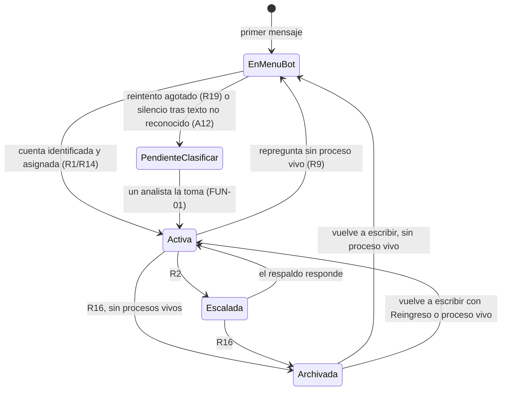

# Auditoría — Fase 3: análisis de brechas

> **Qué es este documento.** La especificación técnica de lo que falta para que el código cumpla la
> línea base de la Fase 1: `01-arquitectura-funcional.md`, con las resoluciones A1–A15 y los
> principios P1–P4. Parte de los hallazgos de la Fase 2 (`02-auditoria-codigo.md`, C#, AL#, M#, B#).
>
> **Tres bloques**, como pidió el encargo:
>
> | Bloque | Prefijo | Contenido |
> |---|---|---|
> | §1 Arquitectura y diseño faltante | **ARQ-##** | Capas, patrones y esquema que no existen o están mal planteados |
> | §2 Funciones faltantes | **FUN-##** | Endpoints, servicios, reglas y casos de uso por programar |
> | §3 Correcciones necesarias | **COR-##** | Código existente que hay que refactorizar |
>
> **Formato de cada brecha:** Origen · Qué falta · Especificación · Archivos · Depende de ·
> Aceptación.
>
> **Convenciones que rigen todo lo especificado** (`CLAUDE.md`):
>
> - Identificadores en español sin tildes.
> - UTC en base de datos y hora de Lima en pantalla.
> - Las reglas devuelven `AccionRegla` y no ejecutan.
> - Plazos y topes en `ConfiguracionReglas`.
> - Migraciones nuevas, nunca editar las aplicadas.
> - El Frontend solo conoce `Contracts`.
> - Nada envía sin pasar por la R15 y el limitador.
>
> Las brechas marcadas **[V-nueva]** crean o cambian una decisión de diseño. Hay que ratificarlas con
> el agente `arquitecto` y registrarlas en `docs/decisiones.md` antes de implementarlas (§5).

---

## 0. Resumen y trazabilidad

**Totales:** 13 brechas de arquitectura, 20 funciones faltantes y 20 correcciones.

### 0.1 De hallazgo a brecha

| Hallazgo (Fase 2) | Brechas que lo cierran |
|---|---|
| C1 R3 inoperante | COR-01, FUN-04, ARQ-08 |
| C2 Menú de vacantes repetido | COR-02 |
| C3 Bot mudo sin plantillas | COR-03, ARQ-07 |
| C4 Resiliencia HTTP reintenta POST | ARQ-04 |
| C5 Reprocesa el evento y duplica | ARQ-02, ARQ-03, COR-04 |
| C6 Ingesta no atómica | ARQ-02, COR-05 |
| AL1 «Sin clasificar» sin dueño | ARQ-05, FUN-01, FUN-06 |
| AL2 Contador del menú | ARQ-05, COR-06 |
| AL3 La repregunta quita el analista | COR-07, FUN-09 |
| AL4 R14 pisa transferencias | COR-08 |
| AL5 Menú no escala y ofrece opciones muertas | FUN-02, FUN-03, COR-09 |
| AL6 Anonimización incompleta | ARQ-13, FUN-16 |
| AL7 Kanban por nombre y sin reversión | COR-11 |
| AL8 Limitador desconectado | COR-12, ARQ-03 |
| AL9 Aviso R6 repetido | COR-10 |
| AL10 Archivado invisible | ARQ-05, FUN-11 |
| M1 Eventos sin consumidor | ARQ-09, FUN-15, ARQ-13 |
| M2 Fallos de entrega invisibles | FUN-13 |
| M3 Adjuntos perdidos | ARQ-10, FUN-14 |
| M4 Escalamiento incompleto | FUN-05, FUN-06, COR-13 |
| M5 Transferencias | FUN-07 |
| M6 Archivado parcial | FUN-11, COR-14 |
| M7 Métricas | ARQ-08, FUN-17 |
| M8 Borde del JobForms | COR-15 |
| M9 Pruebas | ARQ-01, ARQ-12 |
| M10 JWT sin revocación | ARQ-11, FUN-18 |
| M11 `Plantilla.Activa` por defecto | COR-16 |
| B1–B9 | COR-17, COR-18, COR-20 |
| README 🔀 | COR-19 |
| **Nuevo en Fase 3:** sin baja ni edición de analistas, cuentas y vacantes | FUN-19, FUN-20 |
| **Nuevo:** en el menú del bot conviven con «Sin clasificar» | ARQ-05 |
| **Nuevo:** el Apps Script no reintenta el 429 (`Codigo.gs:180`) | COR-15 |

### 0.2 De resolución a brecha

| Resolución | Brechas |
|---|---|
| A1 Transferencias | FUN-07 |
| A2 Reingreso | FUN-08 |
| A3 Multi-cuenta | FUN-09 |
| A5 Retención | COR-14, FUN-16 |
| A6 Menú y código de aviso | FUN-02, FUN-03 |
| A7 | FUN-01 |
| A8 | FUN-04 |
| A9 | FUN-05 |
| A10 | COR-08, FUN-12 |
| A11 | FUN-10 |
| A12 | FUN-06 |
| A13 | COR-07 |
| A14 | FUN-11 |
| A15 | FUN-17 |
| P1 | COR-03 |
| P2 | COR-07, COR-08 |
| P3 | FUN-01, FUN-05, FUN-06 |
| P4 | COR-02, COR-10, COR-11 |

---

## 1. Arquitectura y diseño faltante

### ARQ-01 — Reloj inyectable (`TimeProvider`) en todo el backend

- **Origen:** B7, M9. Sin reloj inyectable, los barridos por tiempo (R2, R9, R16, vencimientos) no
  se pueden probar de punta a punta, y por eso se escaparon C1 y AL10.
- **Qué falta:** los servicios y casos de uso leen `DateTime.UtcNow` directamente.
- **Especificación**
  - Registrar `TimeProvider.System` como singleton en `AgregarInfraestructura`.
  - Inyectar `TimeProvider` en:
    - `FabricaContextoRegla`, `EjecutorAcciones`, `EnvioAnalista`, `ReintentoEnvios`;
    - `RecepcionWebhook`, `RecepcionJobForms`;
    - todos los `*Service` de `Infrastructure/Servicios`.
  - Reemplazar `DateTime.UtcNow` por `reloj.GetUtcNow().UtcDateTime`.
  - `MapeoBandeja` (Api) recibe el instante como parámetro.
  - En pruebas: `Microsoft.Extensions.TimeProvider.Testing` (`FakeTimeProvider`).
- **Archivos:**
  - `src/RRHH.WhatsApp.Infrastructure/RegistroDependencias.cs`
  - `src/RRHH.WhatsApp.Infrastructure/Servicios/*.cs`
  - `src/RRHH.WhatsApp.Application/Casos/*.cs`
  - `src/RRHH.WhatsApp.Api/Mapeo/MapeoBandeja.cs`
  - `tests/RRHH.WhatsApp.Tests/RRHH.WhatsApp.Tests.csproj`
  - `tests/.../Casos/EntornoDeReglas.cs`
- **Depende de:** nada. Es la base.
- **Aceptación:** una búsqueda de `DateTime.UtcNow` en `src/` solo encuentra `ZonaHorariaPeru`, la
  Api de salud y el Frontend. `EntornoDeReglas` expone `Reloj` (FakeTimeProvider) y
  `AvanzarAsync(TimeSpan)`.

### ARQ-02 — Unidad de trabajo transaccional — [V-nueva V28]

- **Origen:** C5, C6. Cada servicio hace su propio `SaveChanges`, así que un caso de uso a medias
  deja el estado inconsistente.
- **Qué falta:** una frontera transaccional explícita por caso de uso.
- **Especificación**
  - Interfaz en `Domain/Interfaces/ServiciosDominio.cs`:

    ```csharp
    public interface IUnidadTrabajo
    {
        Task EjecutarAsync(Func<CancellationToken, Task> trabajo, CancellationToken ct = default);
        Task<T> EjecutarAsync<T>(Func<CancellationToken, Task<T>> trabajo, CancellationToken ct = default);
    }
    ```

  - Implementación `Infrastructure/Persistencia/UnidadTrabajoEf.cs`:
    - usa el `RrhhDbContext` del ámbito;
    - si ya hay una transacción abierta (`db.Database.CurrentTransaction`), ejecuta sin abrir otra;
    - si no, `BeginTransactionAsync(IsolationLevel.ReadCommitted)`, luego `trabajo`, luego `Commit`;
    - ante una excepción: `Rollback` y `db.ChangeTracker.Clear()`, y relanza.
  - Los servicios siguen llamando a `SaveChanges`: dentro de la transacción ambiental se confirman
    juntos.
  - `UseSqlServer` no tiene `EnableRetryOnFailure`, así que la transacción manual es válida. Si
    algún día se activa, envolver con `CreateExecutionStrategy()`.
- **Dónde se usa**
  - COR-05: por mensaje en `RecepcionWebhook` y el caso completo de `RecepcionJobForms`.
  - COR-04: en `ConsumidorOutbox`, procesar más marcar procesado.
  - Acciones de bandeja: `TomarAsync`, `MarcarAsync`, `MoverEtapaAsync`, reasignación de cartera.
- **Archivos:**
  - `Domain/Interfaces/ServiciosDominio.cs`
  - `Infrastructure/Persistencia/UnidadTrabajoEf.cs` (nuevo)
  - `Infrastructure/RegistroDependencias.cs`
- **Depende de:** nada.
- **Aceptación:** prueba contra SQL Server (`RRHH_PRUEBAS_SQL`): una excepción después de
  `PublicarAsync` no deja ni el mensaje ni el evento. En memoria se ignora `TransactionIgnoredWarning`
  (ARQ-12).

### ARQ-03 — Cola de envíos: los salientes del bot se encolan y un despachador los envía — [V-nueva V29]

- **Origen:** C5 (duplicados al reprocesar), AL8 (velocidad) y C4 (un solo punto de envío).
- **Qué falta:** hoy `EjecutorAcciones` llama al proveedor en medio del procesamiento del evento.
  Como un envío no se puede deshacer, no hay transacción posible.
- **Diseño**
  - **Procesar un evento solo escribe en la base.** Cada envío decidido por una regla se registra
    como `Mensaje` saliente con `EstadoEntrega = EnCola` y una `ClaveIdempotencia` única. Todo
    ocurre dentro de la misma transacción que las demás acciones y que `MarcarProcesado`.
  - **Un despachador saca los `EnCola`, revalida la R15, espera turno en el limitador y envía.**
    Luego marca `Enviado` o `Fallido` con su `ClaseFallo`, que ya reutiliza `ReintentoEnvios`.
  - **Clave de idempotencia:** `"{EventoId}:{indice}"` para eventos de outbox;
    `"barrido:{ConversacionId}:{regla}:{marca}"` para el barrido (por ejemplo
    `barrido:15:R09:recordatorio:{InvitacionId}`). Si el evento se reprocesa, el `INSERT` choca con
    el índice único y el mensaje **no se duplica**.
  - **`EnvioAnalista` sigue sincrónico (V14)**, pero registra la fila antes de llamar al proveedor:
    `EnCola`, luego `Enviando`, luego el resultado. Su clave es un GUID generado por la bandeja.
    Así un doble clic no duplica y el Frontend puede reintentar sin miedo.
- **Especificación de esquema** (migración `ColaDeEnvios`)

  | Columna en `Mensajes` | Tipo | Nota |
  |---|---|---|
  | `TipoSaliente` | `int` NOT NULL DEFAULT 1 | Enum `TipoSaliente { Texto = 1, Plantilla = 2, Botones = 3, Lista = 4 }` |
  | `OpcionesJson` | `nvarchar(max)` NULL | Opciones de botones o lista: `[{id, titulo}]`, más el texto del botón de lista |
  | `ClaveIdempotencia` | `nvarchar(150)` NULL | Índice único filtrado `IS NOT NULL` |

  - Índice `IX_Mensajes_EnCola` sobre (`EstadoEntrega`, `FechaEnvio`), filtrado `EstadoEntrega = 6`.
  - `EstadoEntrega` suma `EnCola = 6` y `Enviando = 7`. La comparación de acuses en
    `MensajeService.ActualizarEstadoEntregaAsync` deja de usar el valor numérico y pasa a
    `OrdenAvance(EstadoEntrega)`: EnCola < Enviando < Pendiente < Enviado < Entregado < Leido.
- **Contratos**

  ```csharp
  // Domain/Interfaces
  public sealed record SalienteEncolado(
      TipoSaliente Tipo, string Contenido, int? PlantillaId,
      IReadOnlyList<string>? Parametros, IReadOnlyList<BotonRespuesta>? Opciones, string? TextoBotonLista);

  // IMensajeService
  Task<Mensaje?> EncolarSalienteAsync(int conversacionId, SalienteEncolado saliente,
      string claveIdempotencia, int? analistaId, Guid correlationId, CancellationToken ct = default); // null si la clave existe
  Task<IReadOnlyList<Mensaje>> TomarLoteEnColaAsync(int maximo, CancellationToken ct = default); // pasa a Enviando
  Task MarcarEnvioLogradoAsync(long mensajeId, string? providerMessageId, CancellationToken ct = default); // ya existe
  ```

- **Caso de uso:** `Application/Casos/DespachoEnvios.cs`, con
  `Task<ResumenDespacho> ProcesarAsync(int maximo, CancellationToken ct)`:
  - Revalida la R15 igual que `ReintentoEnvios.MotivoParaNoReintentarAsync`: se extrae a
    `Application/Casos/ValidadorEnvio.cs` y lo usan ambos.
  - Para plantillas, vuelve a cargar la plantilla y comprueba `Activa`.
  - Clasifica el resultado y agenda un reintento si es `Transitorio`.
- **Worker:** `Worker/ServicioDespachoEnvios.cs` (BackgroundService con latido `DespachoEnvios`).
  Opciones `Worker:IntervaloDespachoSegundos` (2) y `Worker:TamanoLoteDespacho` (20).
- **Recuperación:** una fila en `Enviando` durante más de `Worker:TimeoutEnviandoSegundos` (120) es
  un envío cuyo resultado se perdió. Pasa a `Fallido` + `Ambiguo`, sin reintento automático.
- **`EjecutorAcciones`:** `EnviarPlantillaAsync`, `EnviarTextoLibreAsync`, `EnviarMenuAsync` y
  `EnviarLinkJobFormsAsync` dejan de llamar al proveedor y llaman a `EncolarSalienteAsync`. El
  ejecutor recibe la **clave base** en `ContextoRegla.ClaveEjecucion` y numera las acciones.
- **Archivos:**
  - `Domain/Enums/Enumeraciones.cs`, `Domain/Entidades/Conversaciones.cs`,
    `Domain/Interfaces/ServiciosDominio.cs`, `Domain/Reglas/ContextoRegla.cs`
  - `Infrastructure/Persistencia/Configuraciones.cs`, `Infrastructure/Servicios/MensajeService.cs`
  - `Application/Casos/EjecutorAcciones.cs`, `Application/Casos/DespachoEnvios.cs` (nuevo),
    `Application/Casos/ValidadorEnvio.cs` (nuevo), `Application/Casos/ReintentoEnvios.cs`,
    `Application/Casos/EnvioAnalista.cs`
  - `Worker/ServicioDespachoEnvios.cs` (nuevo), `Worker/Program.cs`, `Worker/Latido.cs`
    (`ServiciosVigilados`)
  - `Api/Salud/ChequeoWorker.cs`
- **Depende de:** ARQ-01, ARQ-02, ARQ-04.
- **Aceptación**
  - Procesar dos veces el mismo `EventoId` deja un solo `Mensaje` y **una** llamada al proveedor
    simulado.
  - Tumbar el proceso entre encolar y despachar no pierde el mensaje.
  - Con la ventana cerrada entre encolar y despachar, un texto libre queda `Fallido/Permanente`
    con el motivo de la R15.

### ARQ-04 — Política HTTP de los proveedores sin reintentos implícitos

- **Origen:** C4.
- **Especificación**
  - Quitar `.AddStandardResilienceHandler()` de `RegistroDependencias.cs:140` y `:164`. El único
    reintento del sistema es el de `ReintentoEnvios`, que ya clasifica, respeta la R15 y el
    limitador.
  - Mantener `HttpClient.Timeout = TimeoutSegundos`.
  - En `MetaCloudProvider.EnviarAsync` y `Dialog360Provider.EnviarAsync`, completar la
    clasificación con un `catch (Exception ex) when (!ct.IsCancellationRequested)`:
    - si la petición pudo haber salido (cualquier excepción después de iniciar el envío), es
      `Ambiguo`;
    - si no llegó a salir (`HttpRequestException` con `SocketError` de conexión), es `Transitorio`.
    - **Ninguna excepción del proveedor sale del adaptador.**
  - Quitar la referencia `Microsoft.Extensions.Http.Resilience` si queda sin uso.
- **Archivos:**
  - `Infrastructure/RegistroDependencias.cs`
  - `Infrastructure/Proveedores/MetaCloudProvider.cs`, `Dialog360Provider.cs`
  - `Infrastructure/RRHH.WhatsApp.Infrastructure.csproj`
- **Depende de:** nada.
- **Aceptación:** con un `HttpMessageHandler` falso que responde 503, `MetaCloudProviderTests` ve
  una sola petición y resultado `Transitorio`. Uno que lanza `IOException` después de enviar da
  `Ambiguo`, sin excepción.

### ARQ-05 — Máquina de estados de la conversación — [V-nueva V30]

- **Origen:** AL1, AL2, AL10, A12, P3. Hoy `PendienteClasificar` mezcla tres cosas: el hilo que el
  bot está atendiendo, el que el bot no entendió y el que perdió su contexto.
- **Diseño**



- **Especificación**
  - `EstadoConversacion.EnMenuBot = 6`, que es el estado inicial en `ObtenerOCrearAsync`.
  - `EstadoConversacion.Cerrada` se elimina de los flujos: sin uso, B3. Se deja el valor y se
    documenta como reservado, porque la columna es `int` y ya pudo persistirse.
  - Visibilidad (`ObtenerAccesoAsync`):
    - `EnMenuBot`: `Lectura` solo para Sistemas; `Ninguno` para el resto. No aparece en ninguna
      bandeja.
    - `PendienteClasificar`: `Lectura` para todo analista con rol `Analista`, `Lectura` para
      Sistemas. Para actuar hay que **tomar** la conversación (FUN-01).
  - Campos nuevos en `Conversaciones` (migración `SeguimientoConversacion`):

    | Columna | Tipo | Uso |
    |---|---|---|
    | `IntentosMenuFallidos` | `int` NOT NULL DEFAULT 0 | R19. Reemplaza el conteo derivado (AL2); se reinicia al identificar la cuenta o al entrar al menú |
    | `FechaTextoNoReconocido` | `datetime2` NULL | A12: primer texto libre sin opción válida en la tanda actual |
    | `FechaPendienteDesde` | `datetime2` NULL | P3: entrada a `PendienteClasificar` |
    | `FechaAvisoPendiente` | `datetime2` NULL | FUN-06 |
    | `FechaEscalamiento` | `datetime2` NULL | FUN-05 |
    | `FechaAvisoSegundoNivel` | `datetime2` NULL | FUN-05, y marca «vencida» |
    | `FechaAvisoFueraHorario` | `datetime2` NULL | FUN-04 |

  - Índice (`Estado`, `FechaUltimaActividad`) para el archivado.
  - **Migración de datos:** las conversaciones `PendienteClasificar` sin auditoría
    `DerivadaABandejaGeneral` pasan a `EnMenuBot`.
- **Archivos:**
  - `Domain/Enums/Enumeraciones.cs`, `Domain/Entidades/Conversaciones.cs`
  - `Infrastructure/Persistencia/Configuraciones.cs`, `Infrastructure/Servicios/ConversacionService.cs`
  - `Application/Reglas/Implementaciones/R01…R19`
  - `Api/Mapeo/MapeoBandeja.cs`
  - `Frontend/Components/Bandeja/ListaConversaciones.razor`
- **Depende de:** ARQ-01.
- **Aceptación:** pruebas de escenario:
  - primer mensaje → `EnMenuBot`, invisible en «Sin clasificar»;
  - dos textos no reconocidos → `PendienteClasificar` con `FechaPendienteDesde`;
  - elegir cuenta → `Activa` e `IntentosMenuFallidos = 0`.

### ARQ-06 — Cambios de esquema consolidados

- **Origen:** todos los campos que piden las demás brechas, reunidos para planificar las
  migraciones. **Cada migración es nueva**; ninguna aplicada se edita.

| Migración | Tabla | Cambio | Brecha |
|---|---|---|---|
| `ColaDeEnvios` | `Mensajes` | `TipoSaliente`, `OpcionesJson`, `ClaveIdempotencia` (UQ filtrado), `IX_Mensajes_EnCola` | ARQ-03 |
| `SeguimientoConversacion` | `Conversaciones` | 7 columnas de ARQ-05, índice (`Estado`, `FechaUltimaActividad`), migración de datos | ARQ-05 |
| `DesenlaceYCierre` | `EtapasKanban` | `EstadoResultante int NULL`; semilla: etapa 4 → 2 (Contratado), etapa 5 → 3 (Descartado) | COR-11 |
| | `Postulaciones` | `CierreCortesiaPendiente bit NOT NULL DEFAULT 0`, `FechaCierreCortesia datetime2 NULL`, `FechaAvisoArchivado datetime2 NULL`, `FechaReingreso datetime2 NULL` | FUN-08, FUN-10, FUN-11 |
| `CodigoAvisoVacante` | `HC` | `CodigoAviso nvarchar(12) NULL`, UQ filtrado `IS NOT NULL`; backfill por SQL con código alfanumérico de 6 caracteres sin ambiguos (0/O, 1/I) | FUN-02 |
| `VencimientoTransferencias` | `Transferencias` | `FechaVencimiento datetime2 NULL`; UQ filtrado (`ConversacionId`) `WHERE Estado = 1` | FUN-07 |
| `AdjuntosEntrantes` | `MensajesAdjuntos` (nueva) | ver ARQ-10 | ARQ-10 |
| `AlertasOperativas` | `AlertasOperativas` (nueva) | ver ARQ-09 | ARQ-09 |
| `VersionSeguridadAnalista` | `Analistas` | `VersionSeguridad int NOT NULL DEFAULT 1` | ARQ-11 |
| `IndicesYRetorno` | `EventosSistema` | reemplazar `IX (Estado, FechaCreacion)` por `IX (Estado, Tipo, FechaCreacion)` | ARQ-13 |
| | `JobFormsRespuestas` | UQ filtrado (`InvitacionId`) `IS NOT NULL` | B9 |
| | `Ausencias` | `FechaAvisoRetorno datetime2 NULL` | FUN-12 |
| `ParametrosAtencionPreferente` | `ConfiguracionReglas` | semilla de las claves de §1.1 | varias |

- **Enums sin migración** (se guardan como `int`):
  - `EstadoPostulacion.Reingreso = 5`
  - `EstadoTransferencia.Vencida = 4` y `Retirada = 5`
  - `EstadoConversacion.EnMenuBot = 6`
  - `EstadoEntrega.EnCola = 6` y `Enviando = 7`
  - `TipoSaliente`, `EstadoAdjunto`

#### 1.1 Parámetros nuevos en `ConfiguracionReglas`

Todos se agregan también a `ClavesConfiguracion`.

| Clave | Valor | Descripción (regla) |
|---|---|---|
| `escalamiento.horas_segundo_nivel` | 2 | A9: horas hábiles desde el escalamiento sin respuesta del respaldo antes de avisar a Jefatura |
| `clasificacion.horas_aviso` | 2 | P3: horas hábiles en «Sin clasificar» antes de avisar a Jefatura |
| `menu.reintentos_permitidos` | 1 | R19: reintentos del menú antes de derivar (reemplaza el literal B1) |
| `menu.horas_derivacion` | 2 | A12: horas hábiles de silencio tras un texto no reconocido antes de derivar |
| `transferencia.horas_vencimiento` | 2 | A1: horas hábiles hasta que vence una transferencia no urgente |
| `conversacion.aviso_archivado_dias` | 7 | A14: días antes del archivado en que se avisa al analista |
| `cierre.automatico` | true | A11: el cierre de cortesía sale por defecto al descartar |
| `outbox.retencion_dias_procesados` | 30 | ARQ-13: días que se conservan los eventos procesados |
| `datos.retencion_adjuntos_dias` | 365 | R17: retención de adjuntos entrantes |

- **Cambio de descripción:** `envio.maximo_por_segundo` pasa a decir «por proceso emisor» (COR-12).
- **Clave que desaparece:** `horario.descripcion` deja de leerse (COR-01).

### ARQ-07 — Contexto de reglas y acciones nuevas

- **Origen:** C1, C3, AL2, AL3, AL10, A3, A11, A12. Las reglas no tienen los datos que necesitan
  para decidir bien.
- **Datos nuevos en `ContextoRegla`** (`Domain/Reglas/ContextoRegla.cs`)

  | Propiedad | Tipo | Carga (`FabricaContextoRegla`) | Para qué |
  |---|---|---|---|
  | `ClaveEjecucion` | `string` | `evt:{EventoId}` o `barrido:{…}` | ARQ-03 |
  | `PostulacionesDelPostulante` | `IReadOnlyList<PostulacionVigente>` | reemplaza a `EstadosPostulaciones` | R9, R16, A2, A3 |
  | `FechaActividadAnterior` | `DateTime?` | del payload del evento (instantánea tomada en el webhook **antes** de actualizar) | C1, A13 |
  | `InicioPeriodoFueraHorario` | `DateTime?` | `IHorarioAtencionService` | FUN-04 |
  | `ProximaApertura` | `DateTime?` | ídem | FUN-04 |
  | `OrigenEleccion` | `OrigenEleccion` enum: `Ninguna`, `Boton`, `CodigoAviso`, `NombreCuenta`, `Contexto` | fábrica | AL2, FUN-02 |
  | `PaginaMenu` | `int` | botón `pag_{n}` | FUN-03 |
  | `PostulacionElegidaId` | `int?` | botón `proc_{id}` | FUN-09 |
  | `TransferenciaPendiente` | `Transferencia?` | fábrica | FUN-07 |
  | `EnviarCierreSolicitado` | `bool` | payload de `PostulacionDescartada` | FUN-10 |
  | `MinutosHabilesDesdeEscalamiento` | `double?` | calendario (ARQ-08) | FUN-05 |
  | `MinutosHabilesEnPendiente` | `double?` | ídem | FUN-06 |
  | `MinutosHabilesDesdeTextoNoReconocido` | `double?` | ídem | FUN-06 |

  - `DiasDesdeMensajeAnterior` se reemplaza por
    `double? DiasDesdeActividadAnterior => (AhoraUtc - FechaActividadAnterior)?.TotalDays`.
  - `public sealed record PostulacionVigente(int PostulacionId, int CuentaId, string Cuenta, int HcId, string Vacante, EstadoPostulacion Estado, int? AnalistaAsignadoId, DateTime FechaUltimaActividad)`
  - Derivados: `bool TieneProcesoVivo` (EnProceso o Reingreso) y `IReadOnlyList<int> CuentasVivas`.
- **Acciones nuevas** (`Domain/Reglas/AccionRegla.cs`)

  | Acción | Qué ejecuta | Brecha |
  |---|---|---|
  | `EnviarMensajeBot(string Texto, string? ClavePlantilla, IReadOnlyList<string> Parametros)` | Texto libre si la ventana está abierta; si no, la plantilla activa; si tampoco, `AlertaOperativa` | COR-03 (P1) |
  | `MostrarMenuEmpresas(bool EsReintento, int Pagina = 1)` | Cambia la firma actual | FUN-03 |
  | `MostrarMenuProcesos()` | Botones con las postulaciones vivas y «Otra empresa» | FUN-09 |
  | `TomarContextoDePostulacion(int PostulacionId)` | Fija la cuenta y el analista de esa postulación | FUN-08, FUN-09 |
  | `RegistrarIntentoMenu(bool TextoNoReconocido)` | Suma uno a `IntentosMenuFallidos` y sella `FechaTextoNoReconocido` | COR-06 |
  | `ReiniciarIntentosMenu()` | Pone el contador en 0 y limpia la fecha | COR-06 |
  | `DerivarAPendientes(string Motivo)` | `PendienteClasificar`, sella `FechaPendienteDesde`, auditoría | FUN-06 |
  | `NotificarRol(RolAnalista Rol, string Mensaje)` | `AnalistaNotificado` a cada analista activo del rol | FUN-05, FUN-06 |
  | `SellarConversacion(MarcaConversacion Marca)` | Enum: `AvisoFueraHorario`, `AvisoSegundoNivel`, `AvisoPendiente` | FUN-04–06 |
  | `ArchivarPostulacion(int PostulacionId, string Motivo)` | Estado `Archivada` | FUN-11 |
  | `SellarPostulacion(int PostulacionId, MarcaPostulacion Marca)` | Enum: `AvisoArchivado`, `CierreCortesiaEnviado`, `CierreCortesiaPendiente` | FUN-10, FUN-11 |
  | `VencerTransferencia(int TransferenciaId)` | Estado `Vencida`, aviso a origen y destino | FUN-07 |
  | `ReactivarConversacion(EstadoConversacion Nuevo)` | Sale de `Archivada` | FUN-11 |

- **Se retira:** `ArchivarConversacion` pasa a ser `CambiarEstadoConversacion(Archivada)` más la
  auditoría.
- **Archivos:**
  - `Domain/Reglas/ContextoRegla.cs`, `Domain/Reglas/AccionRegla.cs`
  - `Application/Reglas/IFabricaContextoRegla.cs`
  - `Infrastructure/Servicios/FabricaContextoRegla.cs`
  - `Application/Casos/EjecutorAcciones.cs`, `Application/Casos/RecepcionWebhook.cs` (payload con
    la instantánea)
  - `tests/.../Reglas/ConstructorContexto.cs`
- **Método nuevo en la fábrica:**
  `Task<ContextoRegla> ParaTiempoPostulacionAsync(int postulacionId, CancellationToken ct)`, para
  el barrido por postulación (FUN-10, FUN-11).
- **Depende de:** ARQ-03, ARQ-05, ARQ-08.

### ARQ-08 — Calendario laboral puro en Domain — [V-nueva V31]

- **Origen:** C1 (próxima apertura), M7 (métricas en horas hábiles), FUN-05/06/07.
  `MinutosHabilesEntreAsync` vive en Infrastructure, y Reporting, que solo referencia Domain y
  Contracts, no puede usarlo.
- **Especificación:** `Domain/Calendario/CalendarioLaboral.cs`, estático y sin E/S:

  ```csharp
  public static class CalendarioLaboral
  {
      public static bool EstaEnHorario(IReadOnlyList<HorarioAtencion> tramos, DateTime momentoUtc);
      public static double MinutosHabilesEntre(IReadOnlyList<HorarioAtencion> tramos, DateTime desdeUtc, DateTime hastaUtc);
      public static DateTime? InicioPeriodoFueraDeHorario(IReadOnlyList<HorarioAtencion> tramos, DateTime momentoUtc); // ultimo cierre
      public static DateTime? ProximaApertura(IReadOnlyList<HorarioAtencion> tramos, DateTime momentoUtc);
      public static string Describir(IReadOnlyList<HorarioAtencion> tramos);
  }
  ```

  - La conversión a hora de Lima pasa de `Infrastructure/Servicios/ZonaHorariaPeru.cs` a
    `Domain/Calendario/ZonaHorariaPeru.cs`.
  - `HorarioAtencionService` queda como fachada: carga los tramos (los de la cuenta, o los
    generales) y delega.
  - Se agregan a `IHorarioAtencionService` `InicioPeriodoFueraDeHorarioAsync` y
    `ProximaAperturaAsync`.
  - `ReportingDbContext` suma `DbSet<HorarioAtencion>`.
- **Archivos:**
  - `Domain/Calendario/*` (nuevo)
  - `Infrastructure/Servicios/HorarioAtencionService.cs`, `ZonaHorariaPeru.cs` (se mueve)
  - `Domain/Interfaces/ServiciosDominio.cs`
  - `Reporting/Persistencia/ReportingDbContext.cs`
  - `tests/.../HorarioAtencionServiceTests.cs`, que se trasladan a pruebas del calendario
- **Depende de:** nada.
- **Aceptación:** con un horario de lunes a viernes de 9 a 18, a las 20:00 del viernes el inicio
  del período es el viernes a las 18:00 y la próxima apertura el lunes a las 9:00. Las pruebas
  actuales del servicio siguen verdes.

### ARQ-09 — Alertas operativas persistentes — [V-nueva V32]

- **Origen:** M1. Los eventos `EnvioOmitidoSinPlantilla`, `VacanteSinFormulario`,
  `MenuSinOpciones`, `MenuTruncado` y `EnvioRequierePlantilla` quedan pendientes sin dueño.
- **Diseño:** estos avisos dejan de ser eventos de la outbox y se registran directamente como
  alerta, **agrupadas**: una fila por (Tipo, Clave) con un contador, para no inundar.
  `EnvioRequierePlantilla` deja de publicarse; basta con la auditoría.
- **Tabla `AlertasOperativas`**

  | Columna | Tipo | Nota |
  |---|---|---|
  | `AlertaId` | `int` PK | |
  | `Tipo` | `nvarchar(60)` | Constantes `TiposAlerta` |
  | `Clave` | `nvarchar(150)` | Por ejemplo `hc:12`, `plantilla:cierre_cortesia` |
  | `Detalle` | `nvarchar(1000)` | Último detalle, **sin datos personales** |
  | `Ocurrencias` | `int` | |
  | `FechaPrimera`, `FechaUltima` | `datetime2` | |
  | `FechaResuelta` | `datetime2` NULL | |
  | `ResueltaPorAnalistaId` | `int` NULL FK | |

  - Índice único filtrado (`Tipo`, `Clave`) `WHERE FechaResuelta IS NULL`.
- **Servicio:** `IAlertaOperativaService`:
  - `RegistrarAsync(string tipo, string clave, string detalle, CancellationToken ct)`: upsert que
    suma ocurrencias;
  - `ListarAbiertasAsync(CancellationToken ct)`;
  - `ResolverAsync(int alertaId, int analistaId, CancellationToken ct)`.
- **Health:** `ChequeoWorker` o un chequeo nuevo `alertas` pasa a `Degraded` si hay alertas
  abiertas de tipo `PlantillaNoAprobada` o `VacanteSinFormulario`.
- **Archivos:**
  - `Domain/Entidades/Sistema.cs`, `Domain/Interfaces/ServiciosDominio.cs`
  - `Infrastructure/Servicios/AlertaOperativaService.cs` (nuevo)
  - `Infrastructure/Persistencia/Configuraciones.cs`, `RrhhDbContext.cs`
  - `Application/Casos/EjecutorAcciones.cs`, `RecepcionWebhook.cs` (`TiposEvento` pierde los cinco)
  - `Api/Salud/ChequeoAlertas.cs` (nuevo), `Api/Program.cs`
- **Depende de:** ARQ-02. **Uso en UI:** FUN-15.

### ARQ-10 — Adjuntos entrantes — [V-nueva V33]

- **Origen:** M3.
- **Tabla `MensajesAdjuntos`**

  | Columna | Tipo |
  |---|---|
  | `AdjuntoId` | `bigint` PK |
  | `MensajeId` | `bigint` FK a `Mensajes`, cascade |
  | `TipoMedio` | `nvarchar(20)`: image, document, audio, video, sticker |
  | `ProveedorMedioId` | `nvarchar(150)` |
  | `MimeType` | `nvarchar(100)` |
  | `NombreArchivo` | `nvarchar(255)` NULL |
  | `TamanoBytes` | `bigint` NULL |
  | `Ruta` | `nvarchar(500)` NULL |
  | `Estado` | `int`: `EstadoAdjunto { Pendiente = 1, Descargado = 2, Rechazado = 3, Purgado = 4 }` |
  | `Error` | `nvarchar(500)` NULL |
  | `FechaRecepcion` | `datetime2` |

  - Índice (`Estado`, `FechaRecepcion`).
- **Proveedor**
  - `MensajeEntranteDto` suma `MedioEntranteDto? Medio`, con
    `record MedioEntranteDto(string ProveedorMedioId, string Tipo, string MimeType, string? NombreArchivo, string? Leyenda)`.
  - `InterpreteWebhookMeta.ExtraerContenido` lee `image`, `document`, `audio`, `video` y `sticker`.
    El contenido pasa a ser la leyenda, o `[documento: nombre.pdf]`.
  - `IWhatsAppProvider` suma
    `Task<MedioDescargado?> DescargarMedioAsync(string proveedorMedioId, CancellationToken ct)`.
  - En Meta son dos llamadas: `GET /{media-id}` devuelve la URL, válida unos minutos, y luego
    `GET url` con Bearer. 360dialog usa `GET /media/{id}`. El simulado devuelve bytes fijos.
- **Almacenamiento:** `IAlmacenamientoAdjuntos` reutiliza la cuarentena, el antivirus y el tope de
  `AlmacenamientoCvLocal`. Se extrae la base común `AlmacenamientoArchivosLocal` con
  `Cv:Carpeta/adjuntos`. Extensiones permitidas: `Adjuntos:ExtensionesPermitidas`.
- **Caso y Worker**
  - `Application/Casos/DescargaAdjuntos.cs` más `Worker/ServicioDescargaAdjuntos.cs`, con intervalo
    de 30 s y latido.
  - Descarga pronto: el id de medio de Meta caduca.
- **Archivos:**
  - `Domain/Entidades/Conversaciones.cs`, `Domain/Interfaces/IWhatsAppProvider.cs`,
    `Domain/Interfaces/ServiciosDominio.cs`
  - `Infrastructure/Proveedores/*`, `Infrastructure/Almacenamiento/*`
  - `Infrastructure/Servicios/MensajeService.cs`
  - `Application/Casos/RecepcionWebhook.cs`, `DescargaAdjuntos.cs` (nuevo)
  - `Worker/*`
- **Depende de:** ARQ-02. **Uso:** FUN-14.

### ARQ-11 — Versión de seguridad del analista — [V-nueva V34]

- **Origen:** M10.
- **Especificación**
  - `Analistas.VersionSeguridad` (ARQ-06) se incrementa al desactivar, cambiar el rol o restablecer
    la contraseña.
  - `EmisorTokens` agrega el claim `ver`.
  - En `Program.cs`, `JwtBearerEvents.OnTokenValidated` compara `ver` con
    `IAnalistaService.ObtenerVersionSeguridadAsync(id)`, cacheado 60 s en `IMemoryCache` bajo la
    clave `seg:{id}`. Si no coincide o el analista está inactivo: `context.Fail(...)`.
  - El hub hace la misma validación (mismo evento).
  - La bandeja trata el 401 como sesión cerrada, cosa que ya hace `ClienteApi.cs:258`.
- **Archivos:**
  - `Domain/Entidades/Organizacion.cs`
  - `Infrastructure/Servicios/AnalistaService.cs`, `AutenticacionService.cs`
  - `Api/Seguridad/EmisorTokens.cs`, `Api/Program.cs`
- **Depende de:** FUN-19, que es la que desactiva y cambia roles.

### ARQ-12 — Infraestructura de pruebas de escenario y contra SQL Server

- **Origen:** M9.
- **Especificación**
  - `EntornoDeReglas`:
    - `FakeTimeProvider` (ARQ-01);
    - `ConfigureWarnings(w => w.Ignore(InMemoryEventId.TransactionIgnoredWarning))`;
    - método `ConversarAsync(params PasoConversacion[] pasos)`, donde cada paso es entrante de
      texto, botón, avance de reloj, formulario completado, respuesta del analista, barrido o
      despacho;
    - aserciones `Enviados()`, `EstadoDe(conversacionId)`, `Notificaciones()`.
  - Proyecto de pruebas SQL: `SqlServerFixture`, que crea una base temporal
    `RRHH_Pruebas_{guid}` con `Database.MigrateAsync()` si existe `RRHH_PRUEBAS_SQL`. Cubre índices
    únicos, RowVersion, transacciones y la migración de datos de ARQ-05.
  - **Pipeline:** documentar en el README que `dotnet test` corre ambas familias cuando la variable
    está definida.
- **Archivos:**
  - `tests/.../Casos/EntornoDeReglas.cs`
  - `tests/.../Escenarios/*.cs` (nuevo)
  - `tests/.../Infraestructura/SqlServerFixture.cs` (nuevo)
  - `tests/.../RRHH.WhatsApp.Tests.csproj`
- **Depende de:** ARQ-01.
- **Aceptación:** existen los escenarios de §4 y fallan en el código actual antes de corregirlo.

### ARQ-13 — Minimización y retención de datos en la outbox

- **Origen:** AL6, M1.
- **Especificación**
  - **Payload mínimo.** `MensajeEntranteRecibido` lleva solo `ConversacionId`, `MensajeId`,
    `IdBotonPulsado` y la instantánea `FechaActividadAnterior` (ARQ-07). Sin teléfono, sin texto y
    sin nombre de perfil: la fábrica los lee de la base. Los avisos `AnalistaNotificado` no llevan
    nombre ni teléfono del postulante; la bandeja los muestra al abrir.
  - **Purga.** `IEventoSistemaService.PurgarProcesadosAsync(int dias, int maximo, CancellationToken ct)`
    borra los `Procesado` más viejos que `outbox.retencion_dias_procesados`. Corre en
    `ServicioPurgaCv`, que se renombra `ServicioMantenimientoDatos` con los latidos intactos, o en un
    bucle diario propio.
  - **Índice** (`Estado`, `Tipo`, `FechaCreacion`) (ARQ-06).
- **Archivos:**
  - `Application/Casos/RecepcionWebhook.cs`, `ProcesadorOutbox.cs`
  - `Infrastructure/Servicios/EventoSistemaService.cs`, `ConversacionService.cs` (payloads de
    transferencia)
  - `Worker/ServicioPurgaCv.cs`
- **Depende de:** ARQ-07.

---

## 2. Funciones faltantes

### FUN-01 — Tomar una conversación «Sin clasificar»

- **Origen:** AL1, A7, P3.
- **Endpoint:** `POST /conversaciones/{id}/tomar` con cuerpo `PeticionTomar(int CuentaId)` (Contracts).
  - `200` con `ConversacionResumen`.
  - `409` si otro la tomó primero (RowVersion).
  - `403` si el analista no trabaja esa cuenta.
- **Servicio:**
  `IConversacionService.TomarAsync(int conversacionId, int analistaId, int cuentaId, CancellationToken ct)`.
  Dentro de `IUnidadTrabajo`:
  1. Exige `Estado == PendienteClasificar`.
  2. Exige que `ICuentaService.ObtenerAccesoAsync(cuentaId, analistaId) == Total`.
  3. Fija `CuentaContextoId`, `AnalistaAtendiendoId = analistaId`, `Estado = Activa`,
     `FechaPendienteDesde = null`, `IntentosMenuFallidos = 0`.
  4. Registra la auditoría `TomadaDeBandejaGeneral`.
- **Filtro:** `FiltroAccesoConversacion` permite la acción `tomar` con nivel `Lectura` si el estado
  es `PendienteClasificar`. Se implementa con el atributo `[PermiteTomar]` en la acción.
  `EnvioAnalista`, `TransferirAsync` y `Marcar` rechazan si el estado es `PendienteClasificar`, con
  el motivo «Tomá la conversación antes de actuar».
- **Frontend:** en `PanelChat.razor`, si el estado es `PendienteClasificar`, se muestra un selector
  con las cuentas del analista (`GET /analistas/{id}/cuentas`) y el botón «Tomar». La
  `CajaRespuesta` se oculta hasta tomar. `ClienteApi.TomarAsync`.
- **Archivos:**
  - `Contracts/Bandeja/PeticionesBandeja.cs`
  - `Api/Controllers/ConversacionesController.cs`, `Api/Seguridad/FiltroAccesoConversacion.cs`
  - `Infrastructure/Servicios/ConversacionService.cs`
  - `Application/Casos/EnvioAnalista.cs`
  - `Frontend/Components/Bandeja/PanelChat.razor`, `Frontend/Servicios/ClienteApi.cs`
- **Depende de:** ARQ-02, ARQ-05.
- **Aceptación:** dos analistas toman a la vez y uno recibe 409. Después de tomar, la conversación
  desaparece de «Sin clasificar» y aparece en «Mis conversaciones». Responder sin tomar da 422.

### FUN-02 — Código de aviso por vacante y reconocimiento por texto

- **Origen:** AL5, A6.
- **Generación:**
  - `CuentaService.CrearVacanteAsync` genera `CodigoAviso` único: 6 caracteres de
    `ABCDEFGHJKLMNPQRSTUVWXYZ23456789`, reintentando si colisiona.
  - `PATCH /hc/{id}` (FUN-20) permite cambiarlo, validando el formato `^[A-Z0-9]{4,12}$` y la
    unicidad.
- **Enlace:** `GET /hc/{id}/enlace-aviso` responde `EnlaceAviso(string Codigo, string Enlace)` con
  `https://wa.me/{WhatsApp:NumeroPublico sin +}?text={UrlEncode("Hola, postulo a " + Codigo)}`.
  `WhatsApp:NumeroPublico` va en appsettings de la Api. Pueden verlo titular, respaldo y Sistemas.
- **Reconocimiento** (`FabricaContextoRegla.ParaMensajeEntranteAsync`), solo si no hubo botón:
  1. Un token del texto normalizado (mayúsculas, sin tildes) coincide con el `CodigoAviso` de un HC
     de cuenta activa: `Hc` y `Cuenta`, con `OrigenEleccion = CodigoAviso`. Si el HC está cerrado,
     entra la R20.
  2. Si no, el texto normalizado coincide exactamente con el nombre de una cuenta del menú
     (`ListarMenuAsync`): `OrigenEleccion = NombreCuenta`.
- **Servicios:**
  - `ICuentaService.BuscarVacantePorCodigoAsync(string codigo, CancellationToken ct)`
  - `ICuentaService.BuscarCuentaDeMenuPorNombreAsync(string nombre, CancellationToken ct)`
- **Frontend:** `Vacantes.razor` muestra el código, el enlace con botón copiar y un aviso si falta
  `WhatsApp:NumeroPublico`.
- **Archivos:**
  - `Domain/Entidades/Organizacion.cs`, `Domain/Interfaces/ServiciosDominio.cs`
  - `Infrastructure/Servicios/CuentaService.cs`, `FabricaContextoRegla.cs`
  - `Api/Controllers/VacantesController.cs`, `Api/appsettings.json`
  - `Contracts/Administracion/ContratosAdministracion.cs` (`VacanteResumen` suma `CodigoAviso`),
    `Contracts/Bandeja/PeticionesBandeja.cs`
  - `Frontend/Components/Pages/Vacantes.razor`, `ClienteApi.cs`
- **Depende de:** ARQ-06, ARQ-07, COR-09.
- **Aceptación:** el escenario «Hola, postulo a K7M2QX» envía directo el enlace del formulario de
  esa vacante, sin menú.

### FUN-03 — Menú de empresas paginado

- **Origen:** AL5, A6.
- **Especificación**
  - `IdsBoton.PrefijoPagina = "pag_"` con `ParaPagina(int)` y `LeerPagina(string?)`.
  - `EjecutorAcciones.MostrarMenuEmpresasAsync(accion)`:
    - toma `ICuentaService.ListarMenuAsync()` ordenado por nombre;
    - si hay 10 o menos, lista simple;
    - si hay más, muestra `9` por página y agrega la fila «Ver más empresas» (`pag_{n+1}`); la
      última página agrega «Volver al inicio» (`pag_1`).
    - El tamaño de página es una constante del adaptador, porque es un límite de Meta y no de
      negocio.
  - Pulsar `pag_n` no cuenta como intento fallido: la R19 ve `OrigenEleccion = Ninguna` con
    `PaginaMenu > 0` y devuelve `MostrarMenuEmpresas(false, n)`.
  - Se elimina el evento `MenuTruncado`.
- **Archivos:**
  - `Domain/Entidades/IdsBoton.cs`, `Domain/Reglas/AccionRegla.cs`
  - `Application/Casos/EjecutorAcciones.cs`, `Application/Reglas/Implementaciones/R19FallbackMenu.cs`
  - `Infrastructure/Servicios/FabricaContextoRegla.cs`
- **Depende de:** ARQ-07, COR-09.
- **Aceptación:** con 20 cuentas, la página 1 tiene 10 filas (9 cuentas y «Ver más») y la 3 tiene 2
  cuentas más «Volver». Navegar no deriva a «Sin clasificar».

### FUN-04 — Aviso fuera de horario con próxima apertura

- **Origen:** C1, A8, P1.
- **Regla `R03FueraDeHorario` reescrita**
  - `Aplica`: entrante, fuera de horario, y
    `Conversacion.FechaAvisoFueraHorario is null || < InicioPeriodoFueraHorario`.
  - Resultado:
    - `EnviarMensajeBot(texto, ClavesPlantilla.FueraDeHorario, [descripcion])`, con el texto «Hola,
      recibimos tu mensaje. Nuestro horario es {Describir}. Te responderemos desde el {ProximaApertura en hora de Lima}.»;
    - `SellarConversacion(AvisoFueraHorario)`.
- **Datos:** `InicioPeriodoFueraHorario`, `ProximaApertura` y la descripción los carga la fábrica
  (ARQ-08). Se eliminan el literal de 8 h y la clave `horario.descripcion`.
- **Archivos:**
  - `Application/Reglas/Implementaciones/R03FueraDeHorario.cs`
  - `Infrastructure/Servicios/FabricaContextoRegla.cs`, `ConversacionService.cs` (sellado)
  - `tests/.../Reglas/ReglasFlujoTests.cs`
  - `tests/.../Escenarios/FueraDeHorarioTests.cs`
- **Depende de:** ARQ-07, ARQ-08, COR-03.
- **Aceptación:** el viernes a las 20:00 el postulante escribe tres veces y recibe **un** aviso que
  menciona el lunes a las 09:00. El lunes a las 19:00 vuelve a escribir y recibe otro aviso.

### FUN-05 — Segundo nivel de escalamiento y marca «vencida»

- **Origen:** A9, M4, P3.
- **Regla nueva** `R02SegundoNivel` (código `R02`, prioridad 26, disparador `TiempoTranscurrido`)
  - `Aplica`: `Estado == Escalada`, `FechaAvisoSegundoNivel == null` y hay entrante sin responder.
  - Evalúa `MinutosHabilesDesdeEscalamiento >= escalamiento.horas_segundo_nivel * 60`.
  - Resultado:
    - `NotificarRol(Jefatura, "La conversación de {cuenta} sigue sin respuesta tras escalar.")`;
    - `NotificarAnalista(respaldo)` y `NotificarAnalista(titular)`;
    - `SellarConversacion(AvisoSegundoNivel)`;
    - `RegistrarAuditoria`.
- **Otras piezas**
  - `ConversacionService.EscalarAsync` sella `FechaEscalamiento`. `RegistrarRespuestaAnalistaAsync`
    limpia `FechaAvisoSegundoNivel`.
  - Barrido: `IConversacionService.ListarPendientesSegundoNivelAsync(int maximo, CancellationToken ct)`.
- **Contratos y UI**
  - `ConversacionResumen` suma `bool Vencida` (= `FechaAvisoSegundoNivel != null` y esperando
    respuesta).
  - `ListaConversaciones.razor` muestra un distintivo rojo «vencida».
  - `IAnalistaService.ListarActivosPorRolAsync(RolAnalista rol, CancellationToken ct)`.
- **Archivos:**
  - `Application/Reglas/Implementaciones/R02SegundoNivel.cs` (nuevo)
  - `Infrastructure/RegistroDependencias.cs`, `ConversacionService.cs`, `AnalistaService.cs`
  - `Application/Casos/EjecutorAcciones.cs`
  - `Worker/ServicioBarridoTiempo.cs`
  - `Contracts/Bandeja/ContratosBandeja.cs`, `Api/Mapeo/MapeoBandeja.cs`
  - `Frontend/Components/Bandeja/ListaConversaciones.razor`
- **Depende de:** ARQ-05, ARQ-07, ARQ-08.

### FUN-06 — Plazo de «Sin clasificar» y derivación por silencio

- **Origen:** A12, P3, AL1.
- **Regla `R19DerivacionPorSilencio`** (código `R19`, `TiempoTranscurrido`)
  - `Aplica`: `Estado == EnMenuBot` y `FechaTextoNoReconocido != null`.
  - Si `MinutosHabilesDesdeTextoNoReconocido >= menu.horas_derivacion * 60`: `DerivarAPendientes`.
- **Regla `R19AvisoPendiente`** (código `R19`, `TiempoTranscurrido`)
  - `Aplica`: `Estado == PendienteClasificar` y `FechaAvisoPendiente == null`.
  - Si `MinutosHabilesEnPendiente >= clasificacion.horas_aviso * 60`:
    - `NotificarRol(Jefatura, "Hay un postulante sin clasificar hace {n} h.")`;
    - `SellarConversacion(AvisoPendiente)`.
- **Barrido:**
  - `ListarPendientesDerivacionMenuAsync(int maximo, CancellationToken ct)`
  - `ListarPendientesAvisoClasificacionAsync(int maximo, CancellationToken ct)`
- **Archivos:** reglas nuevas, `ConversacionService.cs`, `ServicioBarridoTiempo.cs`,
  `RegistroDependencias.cs`.
- **Depende de:** ARQ-05, ARQ-07, ARQ-08.

### FUN-07 — Vencimiento y retiro de transferencias

- **Origen:** A1, M5, P2.
- **Alta:** `TransferirAsync`:
  - rechaza un destino con ausencia vigente, porque `IAusenciaService` pasa a inyectarse;
  - en una transferencia no urgente, fija `FechaVencimiento` según `transferencia.horas_vencimiento`
    horas hábiles (`CalendarioLaboral`, horario de la cuenta en contexto).
- **Regla `R08VencimientoTransferencia`** (código `R08`, `TiempoTranscurrido`)
  - `Aplica`: `TransferenciaPendiente is { Urgente: false }` y `AhoraUtc >= FechaVencimiento`.
  - Resultado: `VencerTransferencia(id)`, que ejecuta `IConversacionService.VencerTransferenciaAsync`:
    estado `Vencida`, aviso al origen «venció sin respuesta: el hilo sigue con vos» y al destino.
- **Retiro:** `POST /transferencias/{id}/retirar`, solo el origen y solo si está pendiente, con
  `IConversacionService.RetirarTransferenciaAsync(int transferenciaId, int analistaOrigenId, CancellationToken ct)`:
  estado `Retirada` y aviso al destino.
- **Barrido:** `ListarTransferenciasVencidasAsync(DateTime ahora, int maximo)` devuelve los
  `ConversacionId`.
- **Contratos y UI**
  - `TransferenciaPendiente` suma `DateTime? FechaVencimiento`.
  - `GET /transferencias/enviadas` con `TransferenciaEnviada(...)`, para que el origen vea y retire
    las suyas.
  - `TransferenciasRecibidas.razor` muestra el vencimiento; componente nuevo
    `TransferenciasEnviadas.razor`.
  - `AccionesRapidas.razor` excluye a los analistas ausentes (`GET /analistas/{id}/ausente`, o un
    campo `Ausente` en `AnalistaResumen`).
- **Archivos:**
  - `Domain/Enums/Enumeraciones.cs`, `Domain/Entidades/Conversaciones.cs`
  - `Infrastructure/Servicios/ConversacionService.cs`, `FabricaContextoRegla.cs`
  - `Application/Reglas/Implementaciones/R08VencimientoTransferencia.cs` (nuevo)
  - `Api/Controllers/TransferenciasController.cs`
  - `Contracts/Bandeja/*`
  - `Frontend/Components/Bandeja/*`
- **Depende de:** ARQ-06, ARQ-07, ARQ-08.

### FUN-08 — Reingreso

- **Origen:** A2.
- **Endpoint:** `POST /postulaciones/{id}/reingreso`, para titular o respaldo de la cuenta.
- **Servicio:**
  `IPostulacionService.MarcarReingresoAsync(int postulacionId, int analistaId, CancellationToken ct)`:
  - estado `Reingreso`;
  - `FechaReingreso`;
  - etapa: la primera no final;
  - `CierreCortesiaPendiente = false`;
  - auditoría.
- **Reglas**
  - `TieneProcesoVivo` incluye `Reingreso`.
  - La R16 no archiva `Reingreso` ni `Contratado`.
  - La R9 no repregunta si hay proceso vivo (COR-07).
  - En un entrante sin contexto con **una sola** postulación viva, la R01 aplica
    `TomarContextoDePostulacion`: va directo a su analista.
- **Métricas:** `Reingreso` cuenta como en proceso.
- **UI:** botón «Reingreso» en la tarjeta del tablero (`Tablero.razor`) y en los chips del chat.
- **Archivos:**
  - `Domain/Enums/Enumeraciones.cs`
  - `Infrastructure/Servicios/PostulacionService.cs`
  - `Api/Controllers/PostulacionesController.cs`
  - `Application/Reglas/Implementaciones/R01Asignacion.cs`, `R09RepreguntaEmpresa.cs`,
    `R16Archivado.cs`
  - `Reporting/ReportingReadModel.cs`
  - `Frontend/Components/Pages/Tablero.razor`, `PanelChat.razor`
- **Depende de:** ARQ-07, COR-07, COR-11.

### FUN-09 — Desambiguación multi-cuenta

- **Origen:** A3, AL3, R6, R11.
- **Salida del analista:** `EnvioAnalista`, con texto libre, antepone `[{Cuenta} · {Vacante}] ` si
  `PostulacionesDelPostulante` tiene procesos vivos en más de una cuenta. La vacante es la
  postulación viva más reciente de la cuenta en contexto. Es un helper puro
  `PrefijoMultiCuenta.Aplicar(texto, postulaciones, cuentaContextoId)` en Application.
- **Entrada: regla `R06Desambiguacion`** (código `R06`, prioridad 17, `MensajeEntrante`)
  - `Aplica`: sin botón de cuenta, vacante ni proceso; al menos dos cuentas vivas; y contexto nulo o
    `DiasDesdeActividadAnterior >= conversacion.repregunta_dias`.
  - Resultado: `Detener(MostrarMenuProcesos(), ReiniciarIntentosMenu())`.
- **Botones:**
  - `proc_{postulacionId}` fija `PostulacionElegidaId`, y la R01 aplica `TomarContextoDePostulacion`;
  - `otra_empresa` limpia el contexto y muestra `MostrarMenuEmpresas`.
  - `IdsBoton` suma los prefijos `proc_` y la constante `otra_empresa`.
- **Archivos:**
  - `Domain/Entidades/IdsBoton.cs`, `Domain/Reglas/AccionRegla.cs`
  - `Application/Reglas/Implementaciones/R06Desambiguacion.cs` (nuevo), `R01Asignacion.cs`
  - `Application/Casos/EnvioAnalista.cs`, `EjecutorAcciones.cs`
  - `Application/PrefijoMultiCuenta.cs` (nuevo)
  - `Infrastructure/Servicios/FabricaContextoRegla.cs`
- **Depende de:** ARQ-07, COR-07.

### FUN-10 — Cierre de cortesía controlado

- **Origen:** A11, AL7, C3, P4.
- **Contratos:** `PeticionMarcar` y `PeticionMoverEtapa` suman `bool EnviarCierre = true`. El
  payload de `PostulacionDescartada` suma `EnviarCierre`.
- **Al descartar** (`PostulacionService`, dentro de la unidad de trabajo): si `EnviarCierre` y
  `cierre.automatico`, marca `CierreCortesiaPendiente = true`. Si la postulación ya tiene
  `FechaCierreCortesia`, no hace nada: una sola vez.
- **Regla `R12CierreCortesia` reescrita**
  - `Aplica`: `Postulacion.CierreCortesiaPendiente && FechaCierreCortesia == null`, con disparador
    `CambioEstadoPostulacion` o `TiempoTranscurrido` por postulación.
  - Si `DentroDeHorario`:
    - `EnviarMensajeBot(texto, CierreCortesia, [nombre, vacante])`;
    - `SellarPostulacion(CierreCortesiaEnviado)`, que limpia el pendiente y sella la fecha.
  - Si no, `SinAccion`, y el barrido lo toma dentro del horario.
- **Barrido:** `IPostulacionService.ListarCierresPendientesAsync(int maximo)` con
  `ParaTiempoPostulacionAsync`.
- **UI:** casilla «Enviar mensaje de cierre al postulante», marcada por defecto, en el diálogo
  «Descartar» (`AccionesRapidas.razor`) y al soltar en la columna Descartado (`Tablero.razor`, con
  confirmación).
- **Archivos:**
  - `Contracts/Bandeja/PeticionesBandeja.cs`
  - `Application/Casos/AccionesBandeja.cs`, `ProcesadorOutbox.cs`
  - `Infrastructure/Servicios/PostulacionService.cs`, `FabricaContextoRegla.cs`
  - `Application/Reglas/Implementaciones/R12CierreCortesia.cs`
  - `Worker/ServicioBarridoTiempo.cs`
  - `Frontend/*`
- **Depende de:** ARQ-06, ARQ-07, COR-03, COR-11.

### FUN-11 — Archivado completo, aviso previo y reactivación

- **Origen:** A14, AL10, M6.
- **Regla `R16Archivado`**, por postulación, disparador `TiempoTranscurrido`
  (`ParaTiempoPostulacionAsync`):
  - `Estado ∈ {EnProceso, Descartado}` y `FechaUltimaActividad <= Ahora - conversacion.archivado_dias`:
    `ArchivarPostulacion`.
  - `EnProceso` a `aviso_archivado_dias` del límite y `FechaAvisoArchivado == null`:
    `NotificarAnalista(asignado, "…se archivará el {fecha}")` y `SellarPostulacion(AvisoArchivado)`.
- **Regla `R16ArchivadoConversacion`**, por conversación: sin procesos vivos y
  `FechaUltimaActividad` vencida, `CambiarEstadoConversacion(Archivada)`.
- **Regla `R16Reactivacion`** (`MensajeEntrante`, prioridad 12, antes que la R19)
  - `Aplica`: `Estado == Archivada`.
  - Con **una** postulación viva (`Reingreso`): `ReactivarConversacion(Activa)` y
    `TomarContextoDePostulacion`.
  - Si no: `ReactivarConversacion(EnMenuBot)`, `LimpiarCuentaContexto`, `ReiniciarIntentosMenu` y
    `MostrarMenuEmpresas(false)`, con un saludo de bienvenida de vuelta en el texto.
- **Barrido:**
  - `IPostulacionService.ListarPorArchivarAsync(int dias, int maximo)`
  - `IPostulacionService.ListarPorAvisarArchivadoAsync(int dias, int diasAviso, int maximo)`
- **Archivos:**
  - `Application/Reglas/Implementaciones/R16*.cs`
  - `Infrastructure/Servicios/PostulacionService.cs`, `ConversacionService.cs`
  - `Worker/ServicioBarridoTiempo.cs`
  - `Application/Casos/BarridoTiempo.cs` (suma `ProcesarPostulacionAsync`)
- **Depende de:** ARQ-05, ARQ-07, FUN-08.

### FUN-12 — Aviso de retorno de ausencia

- **Origen:** A10.
- **Caso de uso:** `Application/Casos/AvisoRetornoAusencia.cs`, llamado desde el barrido:
  1. `IAusenciaService.ListarFinalizadasSinAvisoAsync(DateTime ahora)` devuelve las ausencias con
     `FechaFin < ahora` y `FechaAvisoRetorno == null`.
  2. Cuenta las conversaciones que siguen con el respaldo y que se asignaron durante el período:
     auditoría `AsignacionPorAusencia` con fecha dentro del rango, sobre cuentas del titular.
  3. Publica `AnalistaNotificado` al titular: «Durante tu ausencia, {n} conversaciones nuevas
     quedaron con {respaldo}.»
  4. Marca el aviso con `MarcarAvisoRetornoAsync`.
- No es una regla: no decide sobre el postulante, solo informa.
- **Archivos:**
  - `Domain/Entidades/Organizacion.cs`, `Domain/Interfaces/ServiciosDominio.cs`
  - `Infrastructure/Servicios/AusenciaService.cs`
  - `Application/Casos/AvisoRetornoAusencia.cs` (nuevo)
  - `Worker/ServicioBarridoTiempo.cs`
- **Depende de:** ARQ-06.

### FUN-13 — Estado de entrega visible y aviso de fallo

- **Origen:** M2.
- **Contratos:** `MensajeResumen` suma `string? Error` y `IReadOnlyList<AdjuntoResumen> Adjuntos`
  (FUN-14).
- **Webhook:** `IMensajeService.ActualizarEstadoEntregaAsync` devuelve
  `ResultadoAcuse(long MensajeId, int ConversacionId, int? AnalistaId, bool PasoAFallido)`. Si pasó
  a fallido, `RecepcionWebhook` publica, en la misma transacción, `AnalistaNotificado` al autor, o
  al analista que atiende si lo mandó el bot: «Un mensaje no llegó al postulante: {motivo corto}».
- **UI:** `PanelChat.razor` muestra un ícono de estado (enviado, entregado, leído, fallido con
  tooltip). En `CajaRespuesta`, «Reintentar» sobre un mensaje fallido de clase Permanente reusa
  `POST /responder` con el mismo texto.
- **Archivos:**
  - `Contracts/Bandeja/ContratosBandeja.cs`, `Api/Mapeo/MapeoBandeja.cs`
  - `Infrastructure/Servicios/MensajeService.cs`
  - `Application/Casos/RecepcionWebhook.cs`
  - `Frontend/Components/Bandeja/PanelChat.razor`, `wwwroot/bandeja.css`
- **Depende de:** ARQ-02.

### FUN-14 — Adjuntos: ver y purgar

- **Origen:** M3.
- **Endpoint:** `GET /conversaciones/{id}/adjuntos/{adjuntoId}`, protegido por el filtro. Hace
  stream con `Content-Disposition: attachment` y el `Content-Type` guardado, y verifica que el
  adjunto pertenezca a la conversación.
- **Servicio:** `IMensajeService.ObtenerAdjuntoAsync(long adjuntoId, int conversacionId)` más
  `IAlmacenamientoAdjuntos.ObtenerAsync`.
- **Purga:** `ServicioMantenimientoDatos` borra los adjuntos más viejos que
  `datos.retencion_adjuntos_dias`: estado `Purgado` y `Ruta = null`.
- **Contratos:** `AdjuntoResumen(long AdjuntoId, string Tipo, string? NombreArchivo, string Estado)`.
- **UI:** en `PanelChat.razor`, un enlace de descarga; la bandeja lo pide con token vía `ClienteApi`
  y lo sirve con un endpoint del Frontend que hace de proxy, porque el navegador no lleva el
  Authorization.
- **Archivos:**
  - `Api/Controllers/ConversacionesController.cs`
  - `Contracts/Bandeja/ContratosBandeja.cs`
  - `Frontend/Program.cs` (endpoint proxy), `ClienteApi.cs`, `PanelChat.razor`
  - `Worker/*`
- **Depende de:** ARQ-10.

### FUN-15 — Panel de alertas operativas

- **Origen:** M1.
- **Endpoints**
  - `GET /operacion/alertas`: Sistemas y Jefatura.
  - `POST /operacion/alertas/{id}/resolver`: Sistemas.
  - Controlador nuevo `Api/Controllers/OperacionController.cs`.
- **Contratos:** `AlertaOperativaResumen(int AlertaId, string Tipo, string Clave, string Detalle, int Ocurrencias, DateTime FechaPrimera, DateTime FechaUltima)`.
- **UI:** en `/configuracion`, sección «Alertas» con contador en `NavMenu.razor` para Sistemas.
- **Depende de:** ARQ-09.

### FUN-16 — Anonimización extendida y purga de datos

- **Origen:** AL6, R17, A5.
- **`PostulanteService.AnonimizarDatosAsync`** (dentro de `IUnidadTrabajo`), además de lo actual:
  - `Conversaciones` del postulante: `TelefonoE164 = "ANON-{ConversacionId}"`.
  - `Mensajes` de esas conversaciones: `Contenido = "[anonimizado]"`, `ParametrosPlantillaJson = null`,
    `OpcionesJson = null`.
  - `MensajesAdjuntos`: borrar los archivos y pasar a `Purgado`.
  - `EventosSistema` cuyo payload referencia esas conversaciones: `Payload = "{}"`. Con ARQ-13 el
    payload ya no trae datos personales, pero hay histórico.
  - `Auditoria` con `EntidadTipo` Conversacion o Postulante de esas entidades: `Detalle = null`.
  - `JobFormsInvitaciones`: sin cambios (no guarda datos personales).
- Si el postulante vuelve a escribir desde ese número, nace una conversación nueva con opt-in
  nuevo. Es lo correcto después de pedir la eliminación.
- **Retención de CV (A5):** `JobFormsService.ListarCvsPorPurgarAsync` mide contra la **última
  actividad del postulante**: el máximo de `Postulaciones.FechaUltimaActividad` de esa persona. No
  purga si hay una postulación `EnProceso`, `Reingreso` o `Contratado` activa.
- **Archivos:**
  - `Infrastructure/Servicios/PostulanteService.cs`, `JobFormsService.cs`,
    `EventoSistemaService.cs`, `MensajeService.cs`
  - `tests/.../Casos/RetencionDatosTests.cs`
- **Depende de:** ARQ-02, ARQ-10, ARQ-13.

### FUN-17 — Métricas por tanda y en horas hábiles

- **Origen:** M7, A15.
- **Definición:** una *tanda* empieza con un entrante posterior a la última respuesta humana, o con
  el primer entrante. Su primera respuesta es el primer saliente con `AnalistaId` posterior. Se mide
  en **minutos hábiles** con `CalendarioLaboral.MinutosHabilesEntre`, usando el horario de la cuenta
  en contexto del mensaje o el general.
- **Contratos:** `MetricasRespuesta` suma `Tandas`, `TandasRespondidas`, `MinutosHabilesPromedio`,
  `MinutosHabilesMediana`, `PorcentajeDentroDelPlazo`. Los campos actuales de minutos de reloj se
  conservan, renombrados en la UI como «reloj».
- **Actividad por analista:** tiempos por tanda del analista que respondió.
- **Archivos:**
  - `Reporting/ReportingReadModel.cs`, `Reporting/Persistencia/ReportingDbContext.cs`
  - `Contracts/Metricas/ContratosMetricas.cs`
  - `Frontend/Components/Pages/Metricas.razor`
  - `tests/.../Reporting/MetricasGerenciaTests.cs`
- **Depende de:** ARQ-08.

### FUN-18 — Cierre de sesión forzado

- **Origen:** M10.
- **Endpoint:** `POST /sesion/analistas/{id}/cerrar-sesiones`, para Sistemas. Incrementa
  `VersionSeguridad` e invalida la caché `seg:{id}`.
- **Automático:** también ocurre al desactivar o cambiar el rol (FUN-19) y al restablecer la
  contraseña.
- **Archivos:** `Api/Controllers/SesionController.cs`, `AnalistaService.cs`, `AutenticacionService.cs`.
- **Depende de:** ARQ-11.

### FUN-19 — Baja y edición de analistas con reasignación de su cartera

- **Origen:** hallazgo nuevo de la Fase 3. No existe forma de desactivar a quien deja la empresa: la
  bandeja de un analista inactivo quedaría abandonada.
- **Endpoint:** `PATCH /analistas/{id}` con
  `PeticionEditarAnalista(string? Nombre, string? Rol, bool? Activo)`, política `Estructura`.
- **Servicio:**
  `IAnalistaService.ActualizarAsync(int analistaId, string? nombre, RolAnalista? rol, bool? activo, int autorId, CancellationToken ct)`,
  dentro de `IUnidadTrabajo`. Al desactivar o dejar el rol `Analista`:
  1. Por cada conversación que atiende: la pasa al respaldo de la cuenta en contexto, o al titular
     si él era el respaldo. Sin cuenta o sin reemplazo, va a `PendienteClasificar`. Auditoría
     `ReasignadaPorBaja`.
  2. Rechaza sus transferencias pendientes como destino y retira las de origen.
  3. Si era titular o respaldo de alguna cuenta, **no** se borra la asignación automáticamente: se
     registra la alerta `CuentaSinTitular` o `CuentaSinRespaldo` (ARQ-09) y se quita la fila, para
     que Jefatura asigne.
  4. Incrementa `VersionSeguridad`.
- **UI:** en `Equipo.razor`, editar el rol, activar o desactivar con confirmación, mostrando cuántas
  conversaciones se reasignan (`GET /analistas/{id}/cartera` devuelve `{conversaciones, cuentasTitular, cuentasRespaldo}`).
- **Depende de:** ARQ-02, ARQ-09, ARQ-11.

### FUN-20 — Edición de cuentas y vacantes

- **Origen:** hallazgo nuevo. Hoy no se puede corregir `UrlJobForms`, el título ni el código de
  aviso, ni desactivar una cuenta.
- **Endpoints**
  - `PATCH /hc/{id}` con `PeticionEditarVacante(string? Titulo, string? UrlJobForms, string? CodigoAviso)`:
    titular, respaldo y Sistemas. Valida que la URL sea `https` y que el código sea único.
  - `PATCH /hc/{id}/reabrir`: mismos permisos. Una vacante cerrada por error vuelve a `Abierta`.
  - `PATCH /cuentas/{id}` con `PeticionEditarCuenta(string? Nombre, bool? Activo)`, política
    `Estructura`. Desactivar una cuenta con conversaciones activas no las mueve, pero la saca del
    menú y registra una alerta.
- **Servicios:**
  - `ICuentaService.ActualizarVacanteAsync`
  - `ICuentaService.ReabrirVacanteAsync`
  - `ICuentaService.ActualizarCuentaAsync`
- **UI:** `Vacantes.razor` y `Equipo.razor`.
- **Depende de:** FUN-02 (código), ARQ-09.

---

## 3. Correcciones necesarias

### COR-01 — R3: detección del período y texto

- **Origen:** C1.
- **Cambio:** está absorbido por FUN-04. Borrar el chequeo `yaAvisadoEnEstaTanda` basado en
  `FechaUltimoMensajeEntrante`, el literal de 8 h y la lectura de `horario.descripcion`.
- **Prueba de escenario:** entrante real por `RecepcionWebhook` fuera de horario, luego outbox,
  luego despacho: sale un aviso. Tiene que fallar hoy.

### COR-02 — R9 EnvioLink: no reenviar el menú de vacantes

- **Origen:** C2, P4.
- **`R09EnvioLink.EvaluarAsync`**
  - Si el HC no llegó por botón ni por código (`OrigenEleccion ∉ {Boton, CodigoAviso}`):
    - si ya existe invitación **para cualquier vacante abierta de la cuenta**
      (`HcsConInvitacion ∩ VacantesAbiertas ≠ ∅`) o hay una postulación viva en la cuenta:
      `SinAccion`, porque el postulante está conversando;
    - solo si no hay nada: `MostrarMenuVacantes`.
  - `Aplica` deja fuera el estado `Activa` con `AnalistaAtendiendoId` y postulación viva en la
    cuenta.
- **Pruebas:**
  - dos vacantes, elegir una, completar y escribir tres preguntas: **cero** menús adicionales;
  - la cuenta abre una segunda vacante con un hilo vivo: sin menú.

### COR-03 — Mensajes del bot: texto libre dentro de la ventana (P1)

- **Origen:** C3.
- **Cambios**
  - Reglas que pasan a `EnviarMensajeBot(texto, clavePlantilla, parametros)`: R03, R09 de
    confirmación, R09 de seguimiento (recordatorio), R12 y R20.
  - Los textos viven como constantes en `Application/Reglas/TextosBot.cs`. Van en paralelo a
    `DatosSemilla` para que el texto libre y el borrador de la plantilla digan lo mismo.
  - `EjecutorAcciones.EnviarMensajeBotAsync`:
    - con ventana abierta, encola `TipoSaliente.Texto`;
    - con la ventana cerrada y plantilla activa, encola `Plantilla`;
    - si no, registra la alerta `PlantillaNoAprobada` (ARQ-09) y **devuelve `false`**.
  - La R09 de seguimiento sella el recordatorio **solo** si se encoló. Si no, lo deja pendiente
    hasta que la plantilla se apruebe, sin repetir: la alerta se agrupa. Así se corrige el sellado
    de `R09SeguimientoJobForms.cs:49-52`.
  - Para que el ejecutor pueda condicionar el sellado, `SellarPostulacion` y `MarcarRecordatorioJobForms`
    llevan `bool SoloSiSeEnvioAnterior`. Se procesan en el mismo orden de la lista.
- **Archivos:**
  - `Application/Reglas/Implementaciones/R03…, R09ConfirmacionJobForms, R09SeguimientoJobForms, R12…, R20…`
  - `Application/Reglas/TextosBot.cs` (nuevo)
  - `Application/Casos/EjecutorAcciones.cs`
  - `Domain/Reglas/AccionRegla.cs`
- **Depende de:** ARQ-03, ARQ-07, ARQ-09.
- **Aceptación:** con las 6 plantillas inactivas, completar el formulario dentro de las 24 h manda
  la confirmación en texto. Un recordatorio a las 24 h con la ventana cerrada y sin plantilla no se
  envía, deja una alerta y sale cuando la plantilla se activa.

### COR-04 — Consumidor de outbox transaccional

- **Origen:** C5.
- **`ConsumidorOutbox.IntentarAsync`:**
  `unidad.EjecutarAsync(ct => { procesador.ProcesarAsync(evento, ct); eventos.MarcarProcesadoAsync(evento.EventoId, ct); })`.
- **`ProcesadorOutbox`** pasa la clave base `evt:{EventoId}` a la fábrica: `ContextoRegla.ClaveEjecucion`.
- **`MotorReglas`:** una regla que lanza **ya no se ignora**. Hoy se registra y se sigue (`MotorReglas.cs:32-39`),
  lo que puede ejecutar acciones de reglas posteriores sin la decisión de la que falló. Se relanza
  para que el evento completo haga rollback y se reintente. Esto cambia una decisión documentada en
  el código: registrarla.
- **`DifusorNotificaciones`:** sin cambios, porque ya es idempotente en efecto (aviso de UI).
- **Depende de:** ARQ-02, ARQ-03.

### COR-05 — Ingesta atómica

- **Origen:** C6.
- **`RecepcionWebhook`:** por cada `dto`:
  1. `ObtenerOCrearAsync` **fuera** de la transacción: ya es idempotente y maneja la carrera del
     índice único.
  2. `unidad.EjecutarAsync`: capturar la instantánea (ARQ-07), luego `RegistrarEntranteAsync`,
     luego `RegistrarEntradaAsync`, luego `PublicarAsync`.
  - Los acuses de entrega y sus avisos (FUN-13) van en una transacción aparte por acuse.
- **`RecepcionJobForms`:** el caso completo, de `RegistrarDesdeFormulario` a `Publicar`, dentro de
  `unidad.EjecutarAsync`. `ValidarEnvioAsync` sigue lanzando antes de escribir.
- **Depende de:** ARQ-02.
- **Aceptación (SQL):** con un `IEventoSistemaService` que lanza en `PublicarAsync`, el mensaje no
  queda guardado y la reentrega de Meta se procesa como nueva.

### COR-06 — R19: contador persistente y reconocimiento previo

- **Origen:** AL2, A12.
- **Cambios**
  - Borrar `ContarIntentosMenuAsync` (`FabricaContextoRegla.cs:278-288`); `IntentosMenuFallidos`
    sale de la conversación (ARQ-05).
  - `R19FallbackMenu.EvaluarAsync`, cuando `OrigenEleccion == Ninguna` y no hay paginación:
    - si `IntentosMenuFallidos < menu.reintentos_permitidos + 1`:
      `RegistrarIntentoMenu(textoNoReconocido: IntentosMenuFallidos > 0)` y
      `MostrarMenuEmpresas(EsReintento: IntentosMenuFallidos > 0)`;
    - si no: `DerivarAPendientes("…")`.
    - El primer mensaje (contador 0) muestra el menú sin contar como fallo, que es el
      comportamiento actual.
  - `Aplica` exige `Estado == EnMenuBot`, así que en `PendienteClasificar` no hace nada. Corrige B6.
  - R01, R14 y `TomarAsync` emiten `ReiniciarIntentosMenu`.
- **Archivos:**
  - `Application/Reglas/Implementaciones/R19FallbackMenu.cs`
  - `Infrastructure/Servicios/FabricaContextoRegla.cs`, `ConversacionService.cs`
- **Depende de:** ARQ-05, ARQ-07.

### COR-07 — R9 repregunta: continuidad del proceso vivo

- **Origen:** AL3, A13, P2.
- **`R09RepreguntaEmpresa`**
  - `Aplica`: entrante, contexto no nulo, `DiasDesdeActividadAnterior >= conversacion.repregunta_dias`
    (en cualquier dirección, A13) y sin botón.
  - Con un **proceso vivo en la cuenta en contexto** (`EnProceso` o `Reingreso`): `SinAccion`. Sigue
    con su analista.
  - Con procesos vivos en **otras** cuentas: lo resuelve la R06 (FUN-09).
  - Sin procesos vivos: `LimpiarCuentaContexto`, `ReiniciarIntentosMenu` y
    `MostrarMenuEmpresas(false)`. Un `Descartado` **no** bloquea: la persona puede postular a otra
    vacante.
- **`ConversacionService.LimpiarCuentaContextoAsync`:** estado `EnMenuBot`, no `PendienteClasificar`.
  Mantiene `AnalistaAtendiendoId = null`.
- **Prueba de escenario:** un postulante `EnProceso` escribe a los 5 días, sigue con su analista y
  no recibe menú. Uno descartado escribe a los 5 días y recibe el menú de empresas.
- **Depende de:** ARQ-05, ARQ-07.

### COR-08 — R14: no pisar lo asignado y conservar el aviso R6

- **Origen:** AL4, A10.
- **`R14Ausencias`**
  - Emite `AsignarAnalista(respaldo)` **solo** si `AnalistaAtendiendoId is null` o si es igual al
    titular ausente.
  - Si lo atiende un tercero (transferencia o escalamiento), no toca nada.
  - Emite `EstablecerCuentaContexto` solo si cambia.
  - Delega el aviso multi-cuenta en el mismo helper que la R01 (COR-10).
  - Sin respaldo: `DerivarAPendientes` en vez de `CambiarEstadoConversacion(PendienteClasificar)`,
    para que selle `FechaPendienteDesde`.
- **Archivos:** `Application/Reglas/Implementaciones/R14Ausencias.cs`, `tests/.../ReglasAsignacionTests.cs`.
- **Depende de:** ARQ-07.

### COR-09 — El menú solo ofrece opciones que llevan a algún lado

- **Origen:** AL5.
- **Cambios**
  - `ICuentaService.ListarConVacantesAbiertasAsync` se reemplaza por `ListarMenuAsync()`: cuenta
    activa con **titular activo** y al menos una vacante `Abierta` con `UrlJobForms` no vacía.
  - `FabricaContextoRegla.VacantesAbiertasAsync` filtra también las que no tienen formulario.
    Una vacante sin formulario genera la alerta `VacanteSinFormulario` al **crearla o editarla**
    (FUN-20), no al postulante.
  - `GET /cuentas` mantiene la dotación completa para administración.
- **Archivos:**
  - `Domain/Interfaces/ServiciosDominio.cs`
  - `Infrastructure/Servicios/CuentaService.cs`, `FabricaContextoRegla.cs`
  - `Application/Casos/EjecutorAcciones.cs`
  - `Api/Controllers/VacantesController.cs`
  - README
- **Depende de:** ARQ-09.

### COR-10 — Aviso multi-cuenta una sola vez

- **Origen:** AL9, P4.
- **Cambios**
  - En `R01Asignacion`, `NotificarAnalista` sale solo cuando la regla **efectivamente asigna**
    (`AsignarAnalista` en la misma evaluación) o cuando el disparador es `JobFormsCompletado`, o
    sea, cuando nace una postulación en otra cuenta.
  - Con `JobFormsCompletado`, además, se avisa a los analistas asignados **de las otras cuentas**
    vivas: la R6 dice «cada analista recibe un aviso».
  - Helper `AvisoMultiCuenta.Acciones(ctx, analistaDestinoId)` en `Application/Reglas`.
- **Prueba:** tres entrantes seguidos del mismo postulante multi-cuenta dan un solo aviso. Completar
  un formulario en la cuenta B avisa al analista de A y al de B.
- **Depende de:** ARQ-07.

### COR-11 — Kanban: desenlace explícito, reversible e idempotente

- **Origen:** AL7, P4.
- **Cambios**
  - `EtapaKanban` suma `EstadoPostulacion? EstadoResultante` (ARQ-06).
  - `PostulacionService.MoverEtapaKanbanAsync`:
    - `postulacion.Estado = etapa.EstadoResultante ?? (Estado es Contratado/Descartado ? EnProceso : Estado)`.
      Salir de una columna final **revierte** a `EnProceso`, y un `Reingreso` se conserva.
    - Devuelve `ResultadoMovimiento(EstadoPostulacion Anterior, EstadoPostulacion Nuevo, bool Aplicado)`.
  - `AccionesBandeja.MoverEtapaAsync` publica `PostulacionDescartada` solo si
    `Anterior != Descartado && Nuevo == Descartado && Aplicado`. La unicidad del cierre la garantiza
    además `FechaCierreCortesia` (FUN-10).
  - `EtapaFinalDescartadoAsync` busca por `EstadoResultante == Descartado`, no por nombre.
  - Se borran los `StartsWith("Contratado")` y `StartsWith("Descartado")`.
- **Archivos:**
  - `Domain/Entidades/Postulantes.cs`
  - `Infrastructure/Persistencia/Configuraciones.cs`, `DatosSemilla.cs` (semilla nueva en migración)
  - `Infrastructure/Servicios/PostulacionService.cs`
  - `Application/Casos/AccionesBandeja.cs`
  - `Domain/Interfaces/ServiciosDominio.cs`
- **Depende de:** ARQ-06.

### COR-12 — Limitador obediente al parámetro

- **Origen:** AL8.
- **Cambios**
  - `LimitadorEnvio` recibe `Func<int> maximoActual`, que lee `envio.maximo_por_segundo` de
    `IConfiguracionReglasService` a través de un singleton `ProveedorParametrosEnvio` con caché de
    30 s y fallback al valor de appsettings.
  - Se quita `MaximoPorSegundo` de `OpcionesMetaCloud` y `Dialog360Opciones`, o queda solo como
    fallback documentado.
  - La descripción del parámetro dice «por proceso emisor». Con ARQ-03, el emisor del bot es solo
    el Worker; la Api envía únicamente respuestas humanas.
- **Archivos:**
  - `Infrastructure/Proveedores/LimitadorEnvio.cs`
  - `Infrastructure/RegistroDependencias.cs`, `OpcionesMetaCloud.cs`, `Dialog360Opciones.cs`
  - migración de parámetros (descripción)
- **Depende de:** nada.

### COR-13 — Escalamiento sin carrera

- **Origen:** M4.
- **`ConversacionService.EscalarAsync`:** después de recargar la fila, si
  `FechaUltimaRespuestaAnalista >= FechaUltimoMensajeEntrante` o
  `AnalistaAtendiendoId != analistaEsperadoId`, **no escala** y registra el motivo en el log.
- **Firma:** pasa a
  `EscalarAsync(int conversacionId, int analistaEsperadoId, int analistaRespaldoId, string motivo, CancellationToken ct)`.
  La acción `EscalarARespaldo` suma `AnalistaEsperadoId`.
- **Otras piezas:** sella `FechaEscalamiento` (FUN-05). La acción duplicada
  `CambiarEstadoConversacion(Escalada)` de R02 se elimina, porque el servicio ya fija el estado.
- **Depende de:** ARQ-05.

### COR-14 — R16: estados que sí existen

- **Origen:** M6.
- **Cambio:** está absorbido por FUN-11. Aquí se quitan el comentario obsoleto sobre el reingreso y
  el uso de `EstadosPostulaciones`, y se asegura que `EstadoPostulacion.Archivada` se asigne.

### COR-15 — Borde público del JobForms

- **Origen:** M8, y el hallazgo nuevo del Apps Script con el 429.
- **Límite de velocidad**
  - Política nueva `PoliticasLimite.WebhookGoogle`, particionada por **secreto válido** y no por IP,
    con `JobForms:LimitePorMinutoWebhook` (600).
  - `webhook-google` usa esa política. `GET /jobforms/{token}` y `/enviar` siguen con `Publico`.
- **Apps Script** (`scripts/apps-script/Codigo.gs:180`): tratar `429` como reintentable, respetando
  `Retry-After` si viene, y ampliar `REINTENTOS` a 5.
- **CvUrl:** validar `Uri` absoluta `https` con host en `JobForms:DominiosCvPermitidos`
  (`drive.google.com`, `docs.google.com`). Si no cumple, 422.
- **DNI:** `DocumentoIdentidad.Normalizar(string?)` en Domain, que acepta DNI (8 dígitos) o carné de
  extranjería (9 a 12 alfanuméricos) según el tipo. Nulo o inválido da 422, nunca 500.
- **CV huérfano** (`Enviar`, camino propio): validar el token, la invitación no completada y la
  vacante abierta **antes** de `AlmacenarCvAsync`. Si `recepcion.ProcesarAsync` lanza después de
  guardar, `formularios.EliminarCvAsync(ruta)` en un `catch`.
- **Archivos:**
  - `Api/Program.cs`, `Api/Configuracion/PoliticasLimite.cs`, `OpcionesJobForms.cs`
  - `Api/Controllers/JobFormsController.cs`
  - `Domain/Entidades/DocumentoIdentidad.cs` (nuevo)
  - `Infrastructure/Servicios/JobFormsService.cs`
  - `scripts/apps-script/Codigo.gs`
  - `tests/.../Casos/ContratoAppsScriptTests.cs`
- **Depende de:** nada.

### COR-16 — Plantillas inactivas por defecto

- **Origen:** M11.
- **Cambio:** `Plantilla.Activa` pasa a `= false` (`Conversaciones.cs:171`). Una prueba verifica
  que ninguna plantilla nueva nace activa.

### COR-17 — Literales de negocio a parámetros

- **Origen:** B1.
- **Cambios**
  - `R19.ReintentosPermitidos` pasa a `menu.reintentos_permitidos`.
  - Los literales de R03 quedan eliminados por FUN-04.
- **Se mantienen como constantes**, porque son límites de Meta y no de negocio, con el comentario
  que lo explica:
  - `MaximoOpcionesMenu`, `MaximoBotones`, `CuerposMensaje.Recortar`;
  - `PlantillaService.VentanaServicio` y el `24h` de `ContextoRegla`.

### COR-18 — Higiene

- **B2:** `CuentaService.CrearVacanteAsync` agrega la auditoría **después** del primer
  `SaveChanges` (dentro de `IUnidadTrabajo`), con el `HcId` real.
- **B4:** `AutenticacionService.HashFalso` pasa a un `static readonly string` calculado una vez.
- **B5:** resuelto por ARQ-07 y COR-07.
- **B6:** resuelto por COR-06.
- **B9:** índice (ARQ-06).
- **README:** «reglas en Domain» pasa a «reglas en Application» (COR-19).

### COR-19 — Documentación sincronizada con el código

- **Origen:** §8 de la Fase 2.
- **`README.md`**
  - Corregir las afirmaciones de C1, C5, AL5 y AL8.
  - Agregar el despachador, las alertas, los adjuntos y los parámetros nuevos (§1.1).
  - Documentar `WhatsApp:NumeroPublico`, `JobForms:LimitePorMinutoWebhook` y
    `JobForms:DominiosCvPermitidos`.
  - Actualizar la tabla de «Estado».
- **`docs/decisiones.md`**
  - Registrar V28–V34 (§5).
  - Registrar las resoluciones A1–A15 como decisiones con la gerencia (D7…).
  - Registrar el cambio de comportamiento del motor ante una regla que lanza (COR-04).
- **`CLAUDE.md`:** aclarar que los envíos del bot pasan por la cola (ARQ-03) y que los mensajes del
  bot dentro de la ventana van en texto libre (P1).
- **Depende de:** se hace al cerrar cada bloque, no al final.

### COR-20 — Línea base del repositorio

- **Origen:** B8.
- **Cambio:** commitear en una rama de trabajo (por ejemplo `auditoria/linea-base`) los 89 archivos
  modificados y los documentos de auditoría, **antes** de cualquier otra brecha. Verificar build y
  pruebas en ese commit.

---

## 4. Escenarios de aceptación de punta a punta

Se implementan en `tests/RRHH.WhatsApp.Tests/Escenarios/` (ARQ-12). Cada uno recorre webhook,
outbox, reglas, cola y despacho con reloj simulado. **Deben fallar sobre el código actual.**

| # | Escenario | Verifica |
|---|---|---|
| E01 | Primer «Hola» un viernes a las 20:00, tres mensajes más | Un solo aviso fuera de horario con la próxima apertura; estado `EnMenuBot`; invisible en «Sin clasificar» (C1, FUN-04, ARQ-05) |
| E02 | «Hola, postulo a {código}» | Enlace del formulario sin menú (FUN-02) |
| E03 | 20 cuentas: navegar a la página 3 y elegir | Menú paginado sin derivación (FUN-03) |
| E04 | Cuenta con 2 vacantes: elegir, completar con plantillas inactivas y hacer 3 preguntas | Confirmación en texto libre; cero menús extra (C2, C3) |
| E05 | Dos textos no reconocidos | Pasa a `PendienteClasificar`; a las 2 h hábiles, aviso a Jefatura (AL2, FUN-06) |
| E06 | Un texto no reconocido y silencio de 2 h hábiles | Derivado a «Sin clasificar» (A12) |
| E07 | Dos analistas toman el mismo hilo | Uno 200 y otro 409; responder sin tomar da 422 (FUN-01) |
| E08 | Titular sin responder 2 h y respaldo sin responder 2 h | Escala y avisa a Jefatura; marca «vencida» (FUN-05) |
| E09 | Transferencia no urgente sin respuesta | Vence, avisa al origen, permite una nueva (FUN-07) |
| E10 | Titular ausente con hilo transferido a un tercero | La R14 no lo toca (AL4) |
| E11 | Postulante `EnProceso` escribe a los 5 días | Sigue con su analista, sin menú (AL3) |
| E12 | Postulante descartado escribe a los 5 días | Recibe el menú de empresas (AL3) |
| E13 | Postulación inactiva 83 días, luego 90, luego escribe | Aviso previo; archivado; reactivación con menú (FUN-11, AL10) |
| E14 | Descartar, sacar de la columna y volver a descartar | Un solo cierre de cortesía; el estado revierte (AL7, FUN-10) |
| E15 | Descartar a las 21:00 | El cierre sale a la apertura siguiente (FUN-10) |
| E16 | Procesar el mismo evento dos veces / falla después de encolar | Un mensaje y una llamada al proveedor (C5) |
| E17 | `PublicarAsync` lanza en el webhook (SQL) | Nada queda a medias; la reentrega se procesa (C6) |
| E18 | El proveedor responde 503 / pierde la respuesta | Una petición; `Transitorio` / `Ambiguo` sin reintento automático (C4) |
| E19 | Multi-cuenta: dos procesos vivos, escribe tras 3 días | Menú de procesos; el prefijo aparece en la respuesta del analista (FUN-09) |
| E20 | Anonimizar un DNI con mensajes, adjuntos y eventos | No queda teléfono, texto ni nombre (FUN-16) |
| E21 | Desactivar analista con 5 conversaciones | Pasan al respaldo; su token deja de servir (FUN-19, ARQ-11) |
| E22 | Acuse `failed` de una respuesta del analista | Aviso en vivo e ícono de fallido (FUN-13) |
| E23 | Postulante envía un PDF por WhatsApp | Adjunto descargado, escaneado y visible (FUN-14) |

---

## 5. Decisiones nuevas a ratificar con `arquitecto`

| Id propuesto | Decisión | Brecha | Por qué no se puede evitar |
|---|---|---|---|
| **V28** | Unidad de trabajo transaccional explícita por caso de uso | ARQ-02 | Sin ella, C5 y C6 no tienen solución |
| **V29** | Los salientes del bot se encolan en `Mensajes` y los envía un despachador; idempotencia por `ClaveIdempotencia` | ARQ-03 | Un envío no es transaccional: la única forma de no duplicar es separar decidir de enviar |
| **V30** | Estado `EnMenuBot`; tomar es obligatorio para actuar sobre «Sin clasificar» | ARQ-05, FUN-01 | La R19 y la R11 no se sostienen con un solo estado |
| **V31** | Calendario laboral puro en Domain, compartido con Reporting | ARQ-08 | Reporting no puede referenciar Infrastructure |
| **V32** | Alertas operativas agrupadas en tabla propia, fuera de la outbox | ARQ-09 | La outbox no es un buzón de avisos (V9) |
| **V33** | Adjuntos entrantes descargados, escaneados y con retención | ARQ-10 | R17 y el flujo de CV por WhatsApp |
| **V34** | Versión de seguridad del analista en el token | ARQ-11 | Revocar sin estado de sesión |
| **V35** | Una regla que lanza aborta la evaluación y el evento se reintenta | COR-04 | Con transacción, seguir tras un fallo aplica decisiones incompletas |
| **V36** | Mensajes del bot en texto libre dentro de la ventana (P1) | COR-03 | Cambia la premisa de V8 sobre el uso de plantillas |
| **D7** | Resoluciones A1–A15 con la gerencia (atención preferente) | todas | Registro formal del criterio validado |

---

## 6. Dependencias entre brechas (insumo del orden de la Fase 4)

```mermaid
flowchart TD
    COR20[COR-20 Línea base] --> ARQ01[ARQ-01 TimeProvider]
    COR20 --> ARQ04[ARQ-04 HTTP sin reintentos]
    COR20 --> ARQ08[ARQ-08 Calendario]
    COR20 --> COR12[COR-12 Limitador]
    COR20 --> COR15[COR-15 Borde JobForms]
    COR20 --> COR16[COR-16 Plantillas]
    ARQ01 --> ARQ02[ARQ-02 Unidad de trabajo]
    ARQ01 --> ARQ12[ARQ-12 Pruebas de escenario]
    ARQ01 --> ARQ05[ARQ-05 Estados de conversación]
    ARQ02 --> ARQ03[ARQ-03 Cola de envíos]
    ARQ04 --> ARQ03
    ARQ02 --> COR05[COR-05 Ingesta atómica]
    ARQ03 --> COR04[COR-04 Consumidor transaccional]
    ARQ02 --> ARQ09[ARQ-09 Alertas]
    ARQ05 --> ARQ07[ARQ-07 Contexto y acciones]
    ARQ08 --> ARQ07
    ARQ03 --> ARQ07
    ARQ06[ARQ-06 Migraciones] --> ARQ07
    ARQ07 --> COR03[COR-03 Texto libre P1]
    ARQ09 --> COR03
    ARQ07 --> COR01[COR-01/FUN-04 R3]
    ARQ07 --> COR02[COR-02 Menú vacantes]
    ARQ07 --> COR06[COR-06 R19]
    ARQ07 --> COR07[COR-07 R9]
    ARQ07 --> COR08[COR-08 R14]
    ARQ07 --> COR10[COR-10 Aviso R6]
    ARQ06 --> COR11[COR-11 Kanban]
    ARQ09 --> COR09[COR-09 Menú válido]
    COR09 --> FUN02[FUN-02 Código de aviso]
    COR09 --> FUN03[FUN-03 Paginación]
    ARQ05 --> FUN01[FUN-01 Tomar]
    ARQ07 --> FUN05[FUN-05 2º nivel]
    ARQ07 --> FUN06[FUN-06 Plazo sin clasificar]
    ARQ07 --> FUN07[FUN-07 Transferencias]
    COR07 --> FUN08[FUN-08 Reingreso]
    COR11 --> FUN08
    COR07 --> FUN09[FUN-09 Multi-cuenta]
    COR03 --> FUN10[FUN-10 Cierre]
    COR11 --> FUN10
    FUN08 --> FUN11[FUN-11 Archivado]
    ARQ02 --> FUN13[FUN-13 Estado de entrega]
    ARQ02 --> ARQ10[ARQ-10 Adjuntos]
    ARQ10 --> FUN14[FUN-14 Ver adjuntos]
    ARQ09 --> FUN15[FUN-15 Panel alertas]
    ARQ07 --> ARQ13[ARQ-13 Outbox mínima]
    ARQ13 --> FUN16[FUN-16 Anonimización]
    ARQ10 --> FUN16
    ARQ08 --> FUN17[FUN-17 Métricas]
    ARQ11[ARQ-11 Versión seguridad] --> FUN18[FUN-18 Cerrar sesiones]
    ARQ09 --> FUN19[FUN-19 Baja analista]
    ARQ11 --> FUN19
    FUN02 --> FUN20[FUN-20 Editar cuenta y vacante]
    ARQ06 --> FUN12[FUN-12 Retorno ausencia]
```



**Lectura para la Fase 4**

1. **Bloque 0 — estabilizar:** COR-20, luego ARQ-04, COR-12, COR-15, COR-16 y ARQ-01. Son cambios
   chicos que detienen los riesgos de bloqueo inmediatos.
2. **Bloque 1 — confiabilidad:** ARQ-02, ARQ-03, COR-04, COR-05, ARQ-09 y ARQ-12.
3. **Bloque 2 — modelo y contexto:** ARQ-05, ARQ-06, ARQ-08 y ARQ-07.
4. **Bloque 3 — flujo del postulante:** COR-01/FUN-04, COR-02, COR-03, COR-06, COR-07, COR-08,
   COR-09, COR-10, COR-11, FUN-01, FUN-02 y FUN-03.
5. **Bloque 4 — seguimiento por tiempo:** FUN-05, FUN-06, FUN-07, FUN-08, FUN-09, FUN-10, FUN-11 y
   FUN-12.
6. **Bloque 5 — operación y datos:** ARQ-10, ARQ-11, ARQ-13 y FUN-13 a FUN-20.
7. **Transversal:** COR-17, COR-18 y COR-19.
